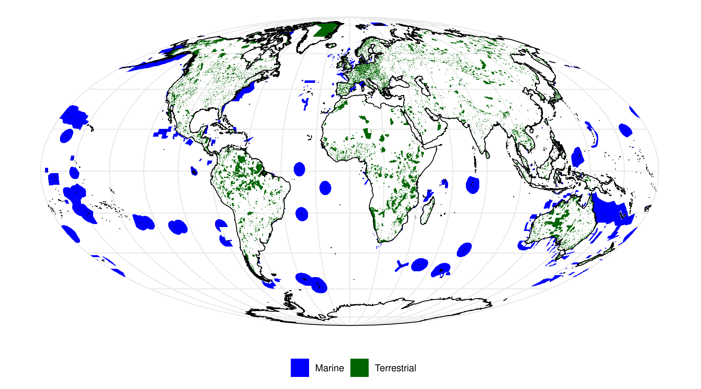
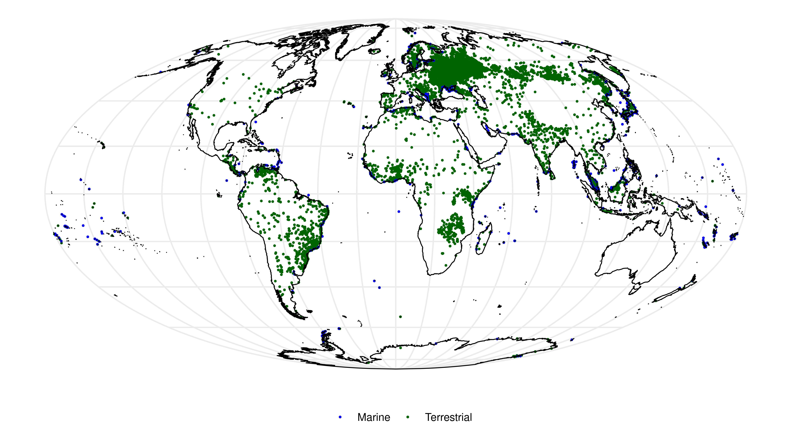
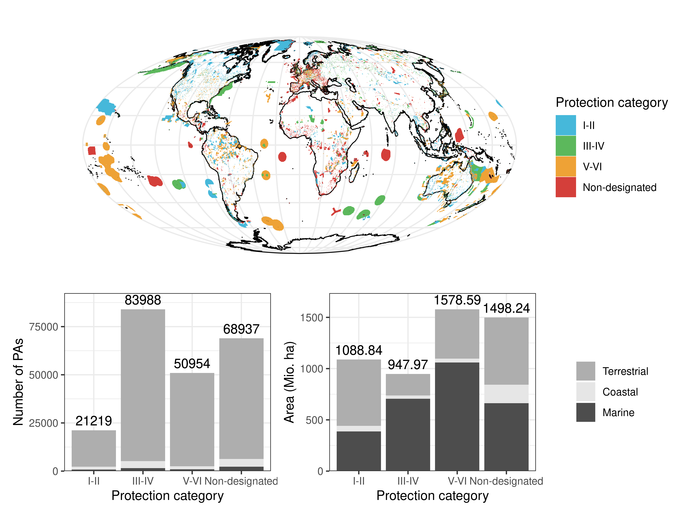
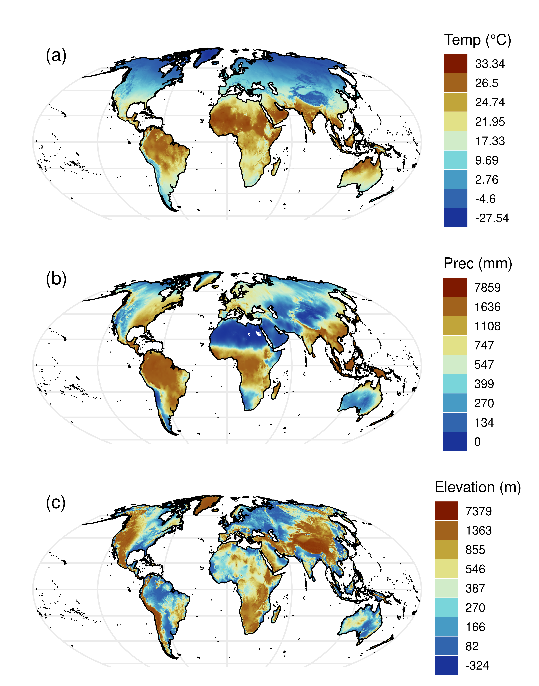
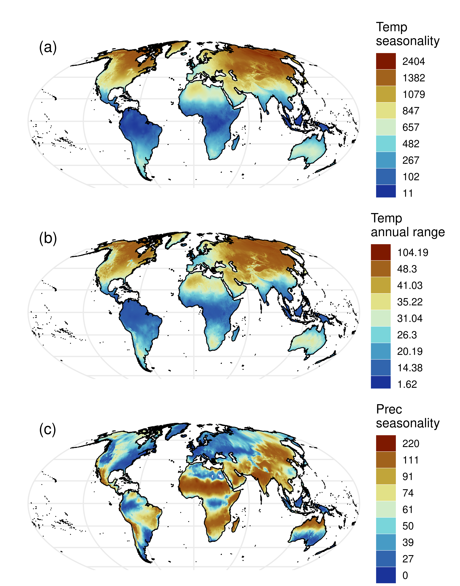
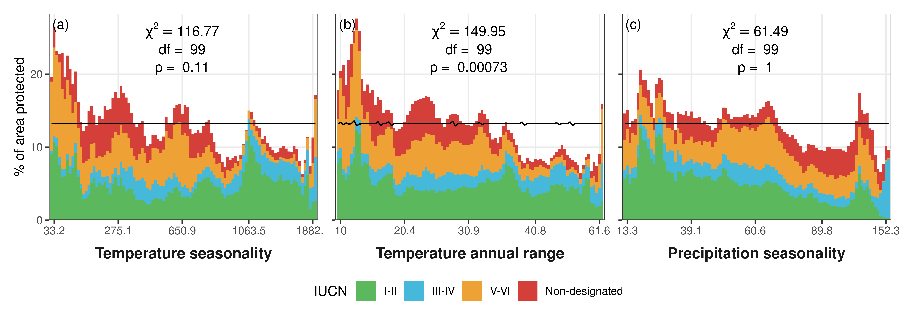
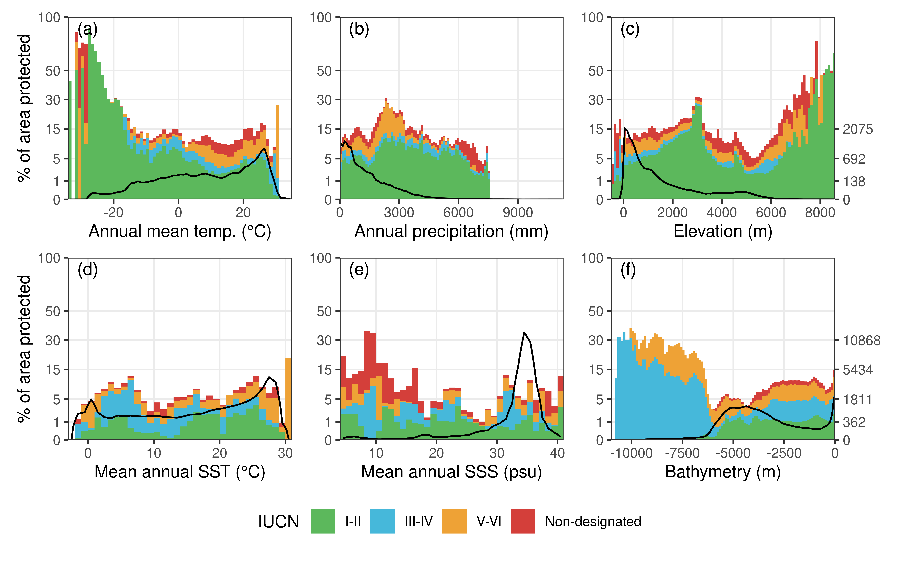

```{r opts, include = FALSE}
knitr::opts_chunk$set(collapse = T, tidy=T, comment = NA, warning=F, message=F, eval=T, echo=F)
```

## Representation of the world's biophysical conditions by the global protected area network

### Appendix S1: Gridded protected area data

<!--


**Figure S1.** Map of marine and terrestrial PAs (polygons only) as of January 2020, all of which were included in the presented analysis (225098 PAs; 208796 terrestrial, 10724 coastal, 5578 marine). Coastal polygons were considered as both, marine and terrestrial. Map is in Mollweide projection (ESRI:54009).



**Figure S2.** Map of marine and terrestrial PAs (point locations only) as of January 2020. These PAs were not included in the presented analysis. Map is in Mollweide projection (ESRI:54009).



**Figure S3.** Map of the protected areas by protection category (I-II, III-IV, V-VI, Non-designated), the number of PAs and the area protected by each category. Map is in Mollweide projection (ESRI:54009).
-->


  
**Figure S1.** Maps of percentage protected per grid cell for each of the four protection categories (I-II, III-IV, V-VI, Non-designated). Maps are in Mollweide projection (ESRI:54009).

### Appendix S2: Environmental data



**Figure S2.** Maps of (a) mean annual temperature (Temp, °C), (b) annual precipitation (Prec, mm), both derived from Worldclim v2 (Fick & Hijmans 2017), and (c) elevation (m) obtained from EarthEnv (Amatulli et al. 2018). Maps are in Mollweide projection (ESRI:54009).



**Figure S3.** Maps of (a) temperature seasonality, (b) temperature annual range and (c) precipitation seasonality according to Worldclim v2 (Fick & Hijmans 2017). Maps are in Mollweide projection (ESRI:54009).


**Figure S4.**  Maps of (a) mean annual sea surface temperature (SST, °C), (b) mean annual sea surface salinity (SSS, psu) and (c) bathymetry (Bathy, m) according to MARSPEC (Sbrocco & Barber 2013). Maps are in Mollweide projection (ESRI:54009).


**Figure S5.**  Maps of (a) annual range in sea surface temperature (SST, °C), (b) annual variance in SST, (c) annual range in sea surface salinity (SSS, psu) and (d) annual variance in SSS according to MARSPEC (Sbrocco & Barber 2013). Maps are in Mollweide projection (ESRI:54009).

### Appendix S3: Additional and extended results



**Figure S6.** Percentage of area protected, separately for different IUCN categories, for different additional climatic conditions for the terrestrial realm, with (a) temperature seasonality, (b) temperature annual range and (c) precipitation seasonality. In order to calculate the percentage of area protected, the different biophysical conditions were divided into bins observed with equal frequency. The optimal number of bins (N <= 100) was derived iteratively for each variable ((a), (b), (c) N = 100). Black lines indicate the expected percentage of area protected given that all conditions are evenly protected. For some variables this line is not flat, as the underlying data is strongly skewed and so no bins observed with absolute equal frequency could be calculated. Note that the individual bins of each variable represent percentile ranges and so cover a different extent, which is also reflected in the irregular intervals of the x-axis.


**Figure S7.** Percentage of terrestrial area protected for each IUCN category (I-II, III-IV, V-VI and Not-designated) and each biophysical variable (Annual mean temperature (°C), temperature seasonality, temperature annual range, annual precipitation (mm), precipitation seasonality and elevation) separately. In order to calculate the percentage of area protected, the different biophysical conditions were divided into bins observed with equal frequency. The optimal number of bins (N <= 100) was derived iteratively for each variable. Black lines indicate the expected percentage of area protected given that all conditions are evenly protected across all IUCN categories. For some variables this line is not flat, as the underlying data is strongly skewed and so no bins observed with absolute equal frequency could be calculated. Note that the individual bins of each variable represent percentile ranges and so cover a different extent, which is also reflected in the irregular intervals of the x-axis.


**Figure S8.** Percentage of area protected, separately for different IUCN categories, for different additional climatic conditions for the marine realm, with (a) annual range in SST, (b) annual variance in SST, (c) annual range in SSS and (d) annual variance in SSS. In order to calculate the percentage of area protected, the different biophysical conditions were divided into bins observed with equal frequency. The optimal number of bins (N <= 100) was derived iteratively for each variable ((a) N = 97, (b) N = 98, (c) N = 69, (d) N = 81). Black lines indicate the expected percentage of area protected given that all conditions are evenly protected. For some variables this line is not flat, as the underlying data is strongly skewed and so no bins observed with absolute equal frequency could be calculated. Note that the individual bins of each variable represent percentile ranges and so cover a different extent, which is also reflected in the irregular intervals of the x-axis.


**Figure S9.** Percentage of marine area protected separately for each IUCN category (I-II, III-IV, V-VI and Not-designated) and each biophysical variable (Mean annual sea surface temperature (SST, °C), annual range in SST, annual variance in SST, mean annual sea surface salinity (SSS, psu), annual range in SSS and annual variance in SSS) separately. In order to calculate the percentage of area protected, the different biophysical conditions were divided into bins observed with equal frequency. The optimal number of bins (N <= 100) was derived iteratively for each variable. Black lines indicate the expected percentage of area protected given that all conditions are evenly protected across all IUCN categories. For some variables this line is not flat, as the underlying data is strongly skewed and so no bins observed with absolute equal frequency could be calculated. Note that the individual bins of each variable represent percentile ranges and so cover a different extent, which is also reflected in the irregular intervals of the x-axis.


**Figure S10.** Area of each zoogeographic realm and the percentage protected by each biophysical condition ((a) temperature, (b) precipitation and (c) elevation) and their pairwise combinations ((d) temperature and precipitation, (e) temperature and elevation, (f) precipitation and elevation). The percentage protected´ was calculated considering all protection categories (I-II, III-IV, V-VI and non-designated) together. Given that the percentage protected is not-normally distributed, the color legend is divided into 12 intervals reflecting a log10-transformed continuous scale.


**Figure S11.** Area of each marine realm and the percentage protected by each each biophysical condition ((a) SST, (b) Salinity and (c) Bathymetry) and their pairwise combinations ((d) SST and Salinity, (e) SST and Bathymetry, (f) SSS and Bathymetry). The percentage protected was calculated considering all protection categories (I-II, III-IV, V-VI and non-designated) together. Given that the percentage protected is not-normally distributed, the color legend is divided into 12 intervals reflecting a log10-transformed continuous scale.

<!--


**Figure S8.** Available land area (a, d, g), protected land area (b, e, h) and the percentage area protected (c, f, h) of each pairwise combination of the biophysical variables (temperature vs. precipitation, temperature vs. elevation and precipitation vs. elevation) based on the equal frequency bins shown in Figure 3.


**Figure S9.** Available marine area (a, d, g), protected marine area (b, e, h) and the percentage area protected (c, f, h) of each pairwise combination of the biophysical variables (sea surface temperature vs. salinity, sea surface temperature vs. bathymetry, salinity vs. bathymetry) based on the equal frequency bins shown in Figure 3.
-->

### Appendix S4: Results with equally-spaced bins



**Figure S12.** Percentage of area protected, separately for different IUCN categories, for different biophysical conditions in the terrestrial (a, b, c) and marine (d, e, f) realm. In order to calculate the percentage of area protected, the different biophysical conditions were divided into equally-spaced bins (1° for temperature and sea surface temperature, 100 mm for precipitation, 1 psu for salinity and 100 m for elevation and bathymetry). Black lines indicate the area that is covered globally by each of the different bins (y-axis on the right-hand side). Note that the scales of both y-axes are square-root transformed.


**Figure S13.** Percentage of land area (a, b, c) and marine area (d, e, f) protected by each pairwise combination of biophysical variables considered (temperature vs. precipitation, temperature vs. elevation and precipitation vs. elevation, sea surface temperature vs. salinity, sea surface temperature vs. bathymetry, salinity vs. bathymetry). Pixels are based on the equally-spaced bins shown in Figure S12. Bar charts indicate the total area that is covered by certain levels of protection. The percentage area protected was calculated considering all protection categories (I-II, III-IV, V-VI and non-designated) together. Given that the percentage protected is not-normally distributed, the color legend is divided into 12 intervals reflecting a log10-transformed continuous scale.


**Figure S14.** Available land area (a, d, g), protected land area (b, e, h) and the percentage area protected (c, f, h) of each pairwise combination of the biophysical variables (temperature vs. precipitation, temperature vs. elevation and precipitation vs. elevation) based on the equally-spaced bins shown in Figure S12. The percentage area protected was calculated considering all protection categories (I-II, III-IV, V-VI and non-designated) together.


**Figure S15.** Available marine area (a, d, g), protected marine area (b, e, h) and the percentage area protected (c, f, h) of each pairwise combination of the biophysical variables (sea surface temperature vs. salinity, sea surface temperature vs. bathymetry, salinity vs. bathymetry) based on the equally-spaced bins shown in Figure S12. The percentage area protected was calculated considering all protection categories (I-II, III-IV, V-VI and non-designated) together.


**Figure S16.** Maps of the percentage of terrestrial realm protected by each biophysical condition ((a) temperature, (b) precipitation and (c) elevation) and their pairwise combinations ((d) temperature and precipitation, (e) temperature and elevation, (f) precipitation and elevation). The percentage area protected is based on the equally-spaced bins (1°/100mm/100m) shown in Figure S12, S13 and was calculated considering all protection categories (I-II, III-IV, V-VI and non-designated) together. Given that the percentage area protected is not-normally distributed, the color legend is divided into 12 intervals reflecting a log10-transformed continuous scale. Maps are in Mollweide projection (ESRI:54009).


**Figure S17.** Maps of the percentage of the marine realm protected by each biophysical condition ((a) SST, (b) Salinity and (c) Bathymetry) and their pairwise combinations ((d) SST and Salinity, (e) SST and Bathymetry, (f) SSS and Bathymetry). The percentage area protected is based on the equally-spaced bins (1°/1psu/100m) shown in Figure S12, S13 and was calculated considering all protection categories (I-II, III-IV, V-VI and non-designated) together. Given that the percentage area protected is not-normally distributed, the color legend is divided into 12 intervals reflecting a log10-transformed continuous scale. Maps are in Mollweide projection (ESRI:54009).
