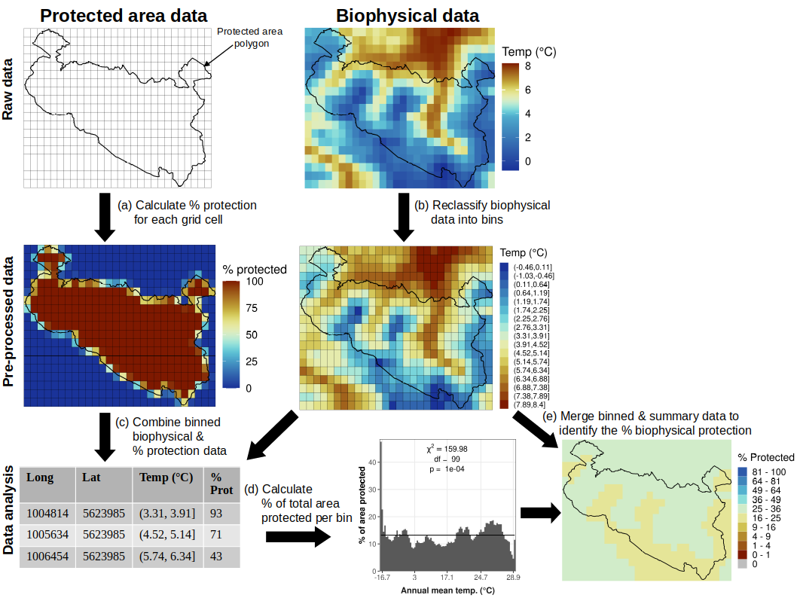
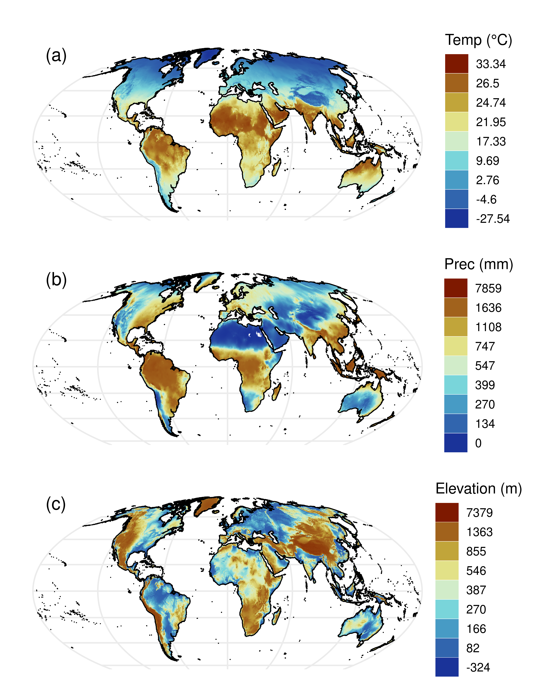
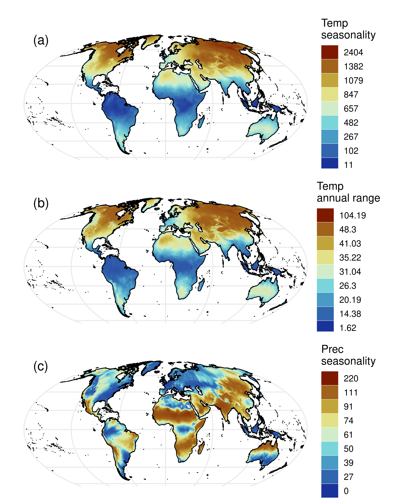
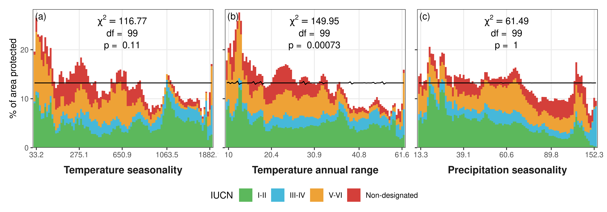
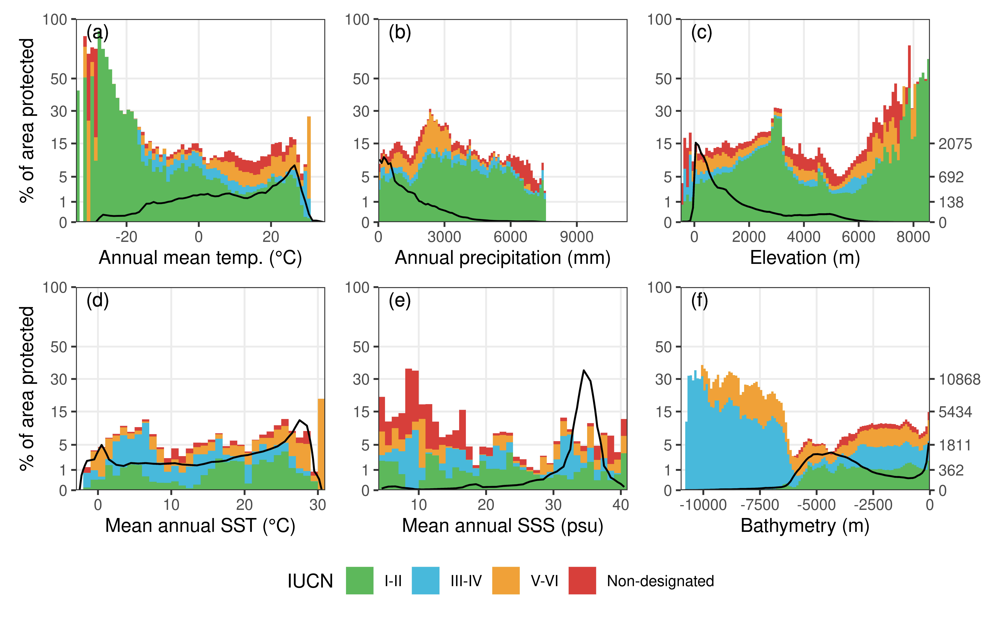

Representation of the world’s biophysical conditions by the global
protected area network
================

**Running head:** Global protection of abiotic conditions

## Abstract

Protected areas (PAs) are one of the most effective ways to conserve
biodiversity and have been steadily growing in number and overall areal
extent. However, PAs are often implemented without consideration of
already existing PAs, which is likely to cause an over-representation of
certain biophysical conditions. Here, we assess the representativeness
of the current PA network with regard to the world’s biophysical
conditions, highlighting which conditions are currently under-protected
and where these conditions are located. For this, we overlayed
terrestrial and marine PAs with information on biophysical conditions
and then quantified the percentage of area covered by the PA network.
Considering one variable at a time, we found that for the terrestrial
realm, high temperature, low precipitation as well as medium and very
high elevation conditions were underrepresented. While for the marine
realm, low and medium sea surface temperature (SST), medium and high sea
surface salinity (SSS) conditions, as well as the deep sea were
underrepresented. Overall, the protection was evenly distributed for
elevation across the terrestrial realm and SST across the marine realm.
Considering two variables at a time, both cold and very dry terrestrial
environments had mostly low protection, which was also the case for low
SST as well as low and medium SSS conditions across most depths for
marine environments. Low-protected conditions mostly occurred in the
Sahara and the Arabian Peninsula for the terrestrial realm and along the
Tropic of Capricorn and towards the poles for the marine realm. While
biodiversity measures are of prime importance for the design of PA
networks, highlighting biophysical gaps in current PAs adds a frequently
overlooked perspective, which may weaken the potential of PAs to
conserve biodiversity. Thus, our study may provide useful insights for
researchers, practitioners and policy makers in order to establish a
more comprehensive global PA network.

**Keywords:** temperature, precipitation, salinity, elevation,
bathymetry, marine, terrestrial, abiotic conditions

## INTRODUCTION

Anthropogenic impacts on biodiversity often vary between land and ocean
as well as across different parts of the world, thus requiring different
conservation priorities for mitigation (Bowler et al. 2020). Protected
areas (PAs) are the most effective tool for in situ conservation (Chape
et al. 2005) and are crucial for reducing habitat loss (Geldmann et
al. 2013), protecting endangered species (Pacifici et al. 2020),
safeguarding biodiversity and conserving the provisioning of ecosystem
services (Stolton & Dudley 2010). As a result, over the last 50 years,
the global PA network has been steadily growing in number and areal
extent, which confirms the recognition by governments to conserve the
planet’s natural ecosystems. The Convention on Biological Diversity
(CBD) has set the target (Aichi’s Biodiversity Target 11) to protect at
least 17% of terrestrial and inland water and 10% of coastal and marine
areas by 2020 in order to improve the status of biodiversity (CBD 2011,
<http://www.cbd.int/sp/targets>) and as of February 2021, around 15.4%
of terrestrial areas and inland waters, 17.8% of coastal and marine
areas within national jurisdiction and 1.2% of the global ocean (areas
beyond national jurisdiction) were covered by PAs (UNEP-WCMC, IUCN & NGS
2021). Aichi Target 11 calls, among others, for the PA network to be
ecologically representative (CBD 2011), recommending a focus on the
representativeness of ecoregions. Whilst this is likely to enhance the
coverage of geographically distinct species assemblages, it is not
necessarily equal to the representativeness of species or other
biological properties (Visconti et al. 2019). Over the last decade,
various strategies, aiming to enhance the ecological representativeness
of PAs, have been developed. They range from focusing on the coverage of
genetic traits (Pollock et al. 2017), groups of individual species
(i.e. species of conservation concern; Venter et al. 2018) or the
protection of mountain biodiversity (Rodriguez-Rodriguez et al. 2011),
to wider aspects including the maintenance of phylogenetic (Rosauer et
al. 2017), functional (Guilhaumon et al. 2014) and geodiversity
(Tukiainen et al. 2017) as well as ecosystem functions (Harvey et
al. 2017) and services (Eastwood et al. 2016).

Accounting for future direct and indirect impacts of climate change is
another aspect that is becoming increasingly important in conservation
planning, and various spatial prioritization approaches incorporating
potential impacts have been developed (Jones et al. 2016; Maxwell et al
2020). With regard to climate change, establishing a PA network that is
still ecologically representative in the future is unforeseeable, while
protecting a representative set of current abiotic conditions is likely
to provide the required diversity of environments to support the
maintenance and establishment of biodiversity under future climatic
conditions (Ackerly et al. 2010; Anderson & Ferree 2010; Beier & Brost
2010). It further allows to forecast scenarios of representativeness in
the face of future climate change (Elsen et al. 2020).

Given that nature is often considered as a continuous gradient of
biophysical conditions, rather than based on a set of discrete units
(from vegetation types to realms), evaluating the representativeness of
nature in PA networks using biophysical gradients may be a promising
approach. The representation of climatic and topographic conditions
across terrestrial protected areas (TPAs) has been assessed at various
spatial scales, ranging from local to global (Rouget et al. 2003; Joppa
& Pfaff 2009; Batllori et al. 2014; Monahan & Fisichelli 2014; Elsen et
al. 2018; Wang et al. 2018). Baldi et al. (2017, 2019) additionally
included the representation of human and biological factors, while Sayre
et al. (2020) assessed the representation of terrestrial ecosystems. On
the contrary, the representation of biophysical conditions across marine
protected areas (MPAs) has been less studied (but see Devillers et
al. 2015; Roberts et al. 2019) and to our knowledge no study so far has
looked at the biophysical representativeness of MPAs at a global level.

Here we aim to assess the protection coverage of the different
biophysical conditions globally and to compare the current level of
protection between the marine and terrestrial realm. For this, we assess
the global protection of terrestrial and marine areas with respect to
various biophysical factors (temperature, precipitation and topography
as well as sea surface temperature (SST), sea surface salinity (SSS) and
bathymetry, respectively). We analyze the protection coverage of each
individual biophysical factor across their respective conditions and
compare how the coverage of biophysical conditions differs among
protection categories, as PAs with a low-protection category (e.g. IUCN
categories IV to VI) have only limited restrictions on resource
exploitation (Shafer, 2015). We specifically test how evenly the
biophysical factors are currently covered by PAs and under which
conditions protection coverage is lower than expected if PAs were
distributed evenly across the biophysical gradient considered. Given
that biophysical variables often show a strong interaction, we also
analyze the protection coverage of the pairwise interaction of
biophysical conditions and, in order to provide recommendations for the
establishment of future PAs, highlight how the protection coverage of
individual biophysical factors and their pairwise combinations is
geographically distributed.

## Methods

In order to evaluate the global protection coverage of biophysical
conditions among the terrestrial and marine realm, we combined the
global protected area and the biophysical data in a common grid and used
this to perform our analysis, the details of which are described below.

### Protected areas

Global PA data were derived from the World Database on Protected Areas
(<https://protectedplanet.net>; IUCN & UN Environment Programme 2020)
and contained polygon data for 225,098 PAs (208,796 terrestrial, 10,724
coastal, 5,578 marine). We excluded PAs for which only point information
is available (21,250 PAs), as these only provide information on their
overall spatial position and areal coverage, but not on their precise
spatial distribution, as required for our analysis. The PA data were
split into marine (coastal and marine) and terrestrial (coastal and
terrestrial) PAs and then further divided into four protection
categories (IUCN categories Ia, Ib and II = I-II, IUCN categories III
and IV = III-IV, IUCN categories V and VI = V-VI, IUCN categories not
reported, not applicable and not assigned = Non-designated).

The IUCN categories group PAs according to their management objectives:
IUCN categories Ia, Ib and II include Strict Nature Reserves, Wilderness
Areas and National Parks and focus on the protection of intact
ecosystems (Dudley 2008), while IUCN categories III and IV include
Natural Monuments or Features and Habitat/Species Management Areas and
IUCN categories V-VI include Protected Land- and Seascapes and Protected
Areas with Sustainable Use of Natural Resources.

For each of the four protection categories, we calculated the percentage
cover of protection for each grid cell of a raster with 30 arc-seconds
resolution and the spatial extent corresponding to the extent of the
respective biophysical data (Fig. 1 a). This resulted in a gridded layer
of percentage cover of protection for each of the four protection
categories (I-II, III-IV, V-VI, Non-designated) for marine and
terrestrial areas respectively. These layers were transformed into
Mollweide Equal-Area projection (ESRI:54009) and in the end covered
162,067,794 and 421,197,812 cells for terrestrial and marine areas,
respectively (Appendix S1).

In addition, we also calculated the percentage cover of protection for
all categories together (total percentage protection) in order to
distinguish where PAs of different designation types have overlapping
extents (Deguignet et al. 2017). The total percentage protection was
then used to adjust cells of overlapping extents (cells where the sum of
the area protected of the individual protection category layers was
larger than the total area protected), by adding up the area protected
by each protection category, starting with the strictest protection
category, until the sum of the individual areas reached the total area
protected. This then resulted in a non-overlapping data set, always
keeping the strictest protection category for areas with overlapping
polygons. This is necessary because if overlapping PAs are not resolved,
the underlying biophysical space would be counted multiple times when
calculating the total percentage coverage.

### Terrestrial data

Annual mean temperature and annual precipitation were obtained from
Worldclim v2 (<https://worldclim.org/>; Fick & Hijmans 2017), which
compiles climatic information over a 30-yr period (1970 - 2000) at a
resolution of 30 arc-seconds. We chose annual mean temperature and total
annual precipitation, as these two variables are the main determinants
of the world’s terrestrial biomes (Holdridge 1947; Whittaker 1975).
Nevertheless, we also provide results for temperature seasonality,
temperature annual range and precipitation seasonality, which were also
obtained from Worldclim v2 (Appendix S3). Worldclim v2 interpolates
observations from weather stations using elevation and distance to
coast, as well as maximum and minimum land surface temperature and cloud
cover derived from MODIS satellite data (Fick & Hijmans 2017).

Elevation data were obtained from EarthEnv
(<http://www.earthenv.org/topography>; Amatulli et al. 2018), which are
based on the global 250 m GMTED2010 digitial elevation model product and
averaged into a 30 arc-seconds grid (Amatulli et al. 2018). Elevation
was used as additional variable, as it is a strong explanatory variable
for species richness (Kaufman & Willig 1998). The EarthEnv dataset does
not include latitudes above 84° North and below -56° South, so we
excluded these areas from the analysis of the terrestrial data.
Worldclim and EarthEnv layers were transformed into Mollweide Equal Area
projection (ESRI:54009; Appendix S2).

### Marine data

Mean annual sea surface temperature (SST), mean annual sea surface
salinity (SSS) and bathymetry were obtained from MARSPEC
(<http://www.marspec.org/>; Sbrocco & Barber 2013). MARSPEC is the best
high-resolution global marine data set currently available and is a
10-fold improvement in spatial resolution of the next-best dataset
(Bio-ORACLE; Tyberghein et al. 2012). It combines different satellite
and in situ observations of SST, SSS and bathymetry of the global ocean
into a harmonized data set at a spatial resolution of 30 arc-seconds.
Bathymetry data were derived from SRTM30\_PLUS v6.0, while the climatic
layers were derived from NOAA’s World Ocean Atlas (SSS) and NASA’s Ocean
Color Web (SST). The climatic variables range over varying time periods
(SSS = 1955 – 2006, SST = 2002 – 2010), but provide both information
about inter-annual means and their variance (Sbrocco & Barber 2013). We
also provide results for annual range in SSS and SST as well as annual
variance in SSS and SST, which were also obtained from MARSPEC (Appendix
S3). All marine layers were transformed into Mollweide Equal Area
projection (ESRI:54009; Appendix S2).

### Protection coverage

We divided the amplitude of each biophysical variable into bins observed
with equal frequency. The respective optimal number of bins (N ≤ 100)
was identified using the “bins” function of the binr package (Izrailev
2015) in R (R Core Team, 2020). For most variables the maximum number of
bins (N = 100) was reached, while some strongly skewed variables
resulted in a much smaller number of bins. For each variable, we then
combined the binned biophysical layer with the different percentage
protection layers and summarized them into the overall proportion of
each bin protected in percent, subsequently referred to as “protection
coverage” (Fig. 1 c, d).

An expected value of protection for each bin was calculated by dividing
the total global terrestrial and marine area protected equally among the
area covered by each bin, which represents a world where all conditions
of a biophysical variable were evenly protected. For each individual
variable, we then compared the protection coverage with the expected
value of protection for each bin and assessed the evenness in the
distribution (by comparing it with the expected value) using a
Chi-Square goodness of fit test. The Chi-Square value denotes the sum of
error values, with a higher value indicating a larger deviance between
the observed and expected values and so implying a lower evenness in
distribution.

Given that using bins observed with equal frequency puts a stronger
emphasis on a small range of conditions (i.e. SSS between 34 and 35.4
psu), we also assessed the protection coverage across each variable
using equally-spaced bins (1°, 100 mm, 100 m and 1 PSU for
temperature/SST, precipitation, elevation/bathymetry and SSS,
respectively; Appendix S4). While this puts the focus on discrete
biophysical conditions, it specifically highlights conditions that might
be rare on a global level, and thus is not really meaningful for
assessing the biophysical representativeness of the global PA network.

To look at the interaction in protection across multiple variables, we
performed the same procedure for each pairwise combination of all
terrestrial and all marine variables separately.

To derive a map of the protection coverage for each variable and their
respective pairwise combinations, which indicates how well the
underlying environmental condition of a given location is protected
globally, we then combined the binned data with the protection coverage
of each individual bin and each pairwise combination (Fig. 1e). In
addition, we summarized the derived maps into the area covered by each
zoogeographic and marine realm (Appendix S3).

The entire analysis was performed in R version 4.0 (R Core Team, 2020),
but required among others the use of R packages specifically designed
for handling large spatial data, such as sf (Pebesma, 2018), fasterize
(Ross, 2020), exactextractr (Baston, 2020) and terra (Hijmans, 2020), as
well as the use of high-performance computers. The full code to run the
performed analysis and recreate the shown figures is publicly available
from: <https://github.com/RS-eco/globePA/>.

**Figure 1.** Illustration of the methodological approach used to
identify the protection coverage of the different conditions for each
biophysical variable: (a) Calculation of the percentage protection for
each grid cell; (b) data of each biophysical variable is reclassified
into bins observed with equal frequency; (c) binned environmental and
gridded percentage protection data is then merged; (d) merged data is
summarized by calculating the proportion of total area protected per
bin; (e) summary data is then merged with the geographic locations of
each bin to identify the protection coverage of each grid cell for a
certain biophysical variable.

## Results

### Overall coverage

For the terrestrial realm, mostly very high (≥ 27 °C) and low to
intermediate (0.6 – 20 °C) temperature conditions were under-protected
(observed lower than expected; Fig. 2 a). Low (≤ 151 mm), intermediate
(270 - 571 mm) and some high (1074 – 1610 mm) annual precipitation
conditions were under-protected (Fig. 2 b), as well as elevational
conditions between 92 and 407 m, 452 and 729 m and above 3944 m (Fig. 2
c). A Chi-square goodness of fit test between the expected and observed
distribution showed that the observed distribution of temperature and
precipitation significantly differed from the expected distribution (p ≤
0.05, Fig. 2 a-c). All of the additional terrestrial variables
considered showed an under-representation towards their upper range and
only temperature annual range significantly differed from the expected
distribution (p ≤ 0.05; Appendix S3). When we only considered PAs with a
strict IUCN protection category (I-II), only annual mean temperature and
precipitation differed significantly from the expected distribution (p ≤
0.05), while for IUCN category III-IV all variables were evenly
distributed (Appendix S3). Looking at the protection coverage across
equally-spaced bins, rare conditions, in particular low temperature and
high elevation conditions, usually had a higher protection coverage than
common ones (Appendix S4).

For the marine realm, particularly low and medium SST conditions were
under-protected (Fig. 2 d), intermediate (32.7 – 34.9 psu) and high (≥
36 psu) SSS conditions were under-protected (Fig. 2 e), as was most of
the deep sea (-3634 - - 5999 m), in stark contrast to intermediate and
very shallow depths as well as depths below 6000 m (Fig. 2 f). For the
marine realm, SSS and bathymetry showed a significant difference (p ≤
0.05) in the goodness of fit between the expected and observed
distribution, but here the contribution of the different IUCN categories
varied strongly across conditions, at least for SST and SSS (Fig. 2
d-f). The variance and annual range in SST were under-protected towards
distinct lower and upper conditions, while almost all conditions in the
annual range and annual variance in SSS were under-protected. However,
only annual variance in SST differed significantly from the expected
distribution (p ≤ 0.05, Appendix S3). For bathymetry, annual range in
SST, and all SSS variables the protection coverage was evenly
distributed across all IUCN categories, while mean annual and annual
variance in SST both significantly differed from the expected
distribution (p ≤ 0.05) for IUCN category III-IV and Not-designated
(Appendix S3). Again, when considering equally-spaced bins, rare
conditions, specifically low SSS and very deep conditions, usually had a
higher protection coverage than more common ones (Appendix S4).

**Figure 2.** Percentage of area protected (see Fig. 1 d), divided by
the different IUCN categories, across biophysical conditions for
different variables in the terrestrial ((a) temperature, (b)
precipitation and (c) elevation) and marine ((d) sea surface temperature
(SST), (e) sea surface salinity (SSS) and (f) bathymetry) realm. In
order to calculate the percentage of area protected, the different
biophysical conditions were divided into bins observed with equal
frequency. The optimal number of bins (N &lt;= 100) was derived
iteratively for each variable ((a) N = 100, (b) N = 100, (c) N = 100,
(d) N = 96, (e) N = 84, (f) N = 100). Black lines indicate the expected
percentage of area protected given that all conditions are evenly
protected. For some variables this line is not flat, as the underlying
data is strongly skewed and so no bins observed with absolute equal
frequency could be calculated. Note that the individual bins of each
variable represent percentile ranges and so cover a different extent,
which is also reflected in the irregular intervals of the x-axis. See
Appendix S4 for a similar figure based on equally-spaced bins.

### Interaction coverage

Looking at the pairwise interaction of variables in the terrestrial
realm, we found that for temperature and precipitation primarily
conditions at the lower temperature and upper precipitation limit had a
high protection coverage, whilst conditions that were either at the
upper temperature limit or at the lower precipitation limit tended to be
only marginally protected. In addition, there were discrete conditions
with very low temperatures and low and high precipitation which were not
protected at all (Fig. 3 a). For the interaction of temperature and
elevation, areas with low temperature and low elevation were very
strongly protected, while mostly very high temperature and high
elevation conditions were only marginally protected (Fig. 3 b). For
precipitation and elevation again the majority of the upper
precipitation limits had a high protection coverage across all
elevational bands, while conditions with low precipitation and very high
elevation were either marginally protected or not protected at all (Fig.
3 c). Overall, the combination of temperature and elevation was best
protected (largest area with high protection coverage), while the
combination of temperature and precipitation had the largest area with a
low protection (Fig 3 d).

For the marine realm, the patterns were less clear. Most SSS and SST
conditions were only marginally or not at all protected, with a few
well-protected conditions, which occurred most frequently at high SSS
across various SST conditions (Fig. 3 e). For bathymetry and SST (Fig. 3
f) and for bathymetry and SSS (Fig. 3 g), very well-protected conditions
mostly occurred at very shallow depths (0 – 46 m) across all SSS and SST
conditions (Fig. 3 f, g), in depths deeper than 5755 m with very low
(around 0°C) SST conditions (Fig. 3 f) and at SSS conditions of 32 –
32.5 and 35.4 – 35.7 psu across most depths (Fig. 3 g). Low-protected
and not-protected at all were mostly low SST conditions (around 10°C)
across various depths (Fig. 3 f) and very low (around 20 psu) and medium
(around 34.5 psu) SSS conditions across various depths (Fig. 3 g). For
the marine realm, the combination of SST and SSS showed the largest area
with a low protection and all pairwise combinations had a considerable
area with conditions that are currently not protected at all (Fig. 3 h).

**Figure 3.** Percentage of land area (a, b, c) and marine area (d, e,
f) protected by each pairwise combination of the biophysical variables
considered (temperature vs. precipitation, temperature vs. elevation and
precipitation vs. elevation, sea surface temperature (SST) vs. sea
surface salinity (SSS), SST vs. bathymetry, SSS vs. bathymetry). Pixels
are based on the bins observed with equal frequency shown in Fig. 2 (see
Appendix S4 for a similar figure based on equally-spaced bins). Bar
charts (d, h) indicate the total area that is covered by certain levels
of protection. The percentage area protected was calculated considering
all protection categories (I-II, III-IV, V-VI and non-designated)
together. Given that the percentage of area protected is not-normally
distributed, the colour legend is divided into 10 intervals reflecting a
log10-transformed continuous scale.

### Spatial patterns

Looking at the spatial patterns of the protection coverage among the
different variables, we found that 68 % of the terrestrial realm had
temperature conditions that were protected by 10 - 16 %. Greenland
exhibited unique temperature conditions which had a high protection,
while large parts of the Sahara and the Arabian Peninsula exhibited
temperature conditions that were only marginally protected (Fig. 4 a).
Around 77 % of the terrestrial realm experienced precipitation
conditions that were protected by 10 – 16 %, while 9 % were protected by
16 – 25 %. The northern part of South America (mostly Colombia, Peru,
Bolivia & Brazil), some tropical regions in West Africa, parts of
Indonesia and some parts of China (mostly the Himalayan region)
experienced precipitation conditions that had a high protection (Fig. 4
b). 89 % of the terrestrial realm had elevational bands that were
protected by 10 – 16 % and 9.9 % that were protected by 16 – 25 %.

Elevational conditions with a high protection were mostly located in
Greenland and China (Fig. 4 c). Looking at the spatial overlap of the
different terrestrial variables, we found that unique combinations of
temperature and precipitation conditions that were protected by ≤ 16 %
occurred all over the world, covering about 71 % of the terrestrial
realm (Fig. 3 d). Areas with a low protection were mostly located in the
western part of the USA, large parts of the Sahara and the Arabian
Peninsula, as well as parts of Central Asia (Fig. 4 d). Unique
combinations of temperature and elevation conditions that were protected
by ≤ 16 % covered around 73 % of the terrestrial realm (Fig. 3 d). Areas
where the combination of temperature and elevation conditions were
highly protected mostly occurred in Greenland, parts of South America as
well as parts of Russia and China, while areas that experienced
conditions that were only little protected were mostly located in the
western part of the Sahara as well as the Arabian Peninsula, but also
across Argentina, Australia, Russia and the USA (Fig. 4 e). Areas that
were protected by ≤ 16 % of unique combinations of precipitation and
elevation conditions covered 75 % of the terrestrial realm (Fig. 3 d).
Locations with a low protection of this combination were found along
Chile, as well as parts of the Sahara, the Arabian Peninsula and China,
while locations with highly protected conditions covered large parts of
northern South America, parts of eastern Africa, Indonesia and New
Guinea, the Himalayan Mountains, as well as parts of Greenland (Fig. 4
f). Overall, the protection coverage strongly differed among
zoogeographic realms and the variable or variable combination considered
(Appendix S3).

**Figure 4.** Maps of the percentage of terrestrial realm protected by
each biophysical condition ((a) temperature (Temp), (b) precipitation
(Prec) and (c) elevation) and their pairwise combinations ((d)
temperature and precipitation, (e) temperature and elevation, (f)
precipitation and elevation). The percentage area protected is based on
the bins observed with equal frequency shown in Figure 2 and 3 and was
calculated considering all protection categories (I-II, III-IV, V-VI and
non-designated) together. Given that the percentage protected is
not-normally distributed, the color legend is divided into 10 intervals
reflecting a log10-transformed continuous scale. See Appendix S4 for
maps based on equally-spaced bins. Maps are in Mollweide projection
(ESRI:54009).

43 % of marine areas had SST conditions that were protected by 1 - 6 %
and 57 % that were protected by 6 – 16 % (Fig. 5 a); 46 % of marine
areas had SSS conditions that were protected by 1 - 6 %, while 54 % of
marine areas were protected by 6 – 25 % (Fig. 5 b); and 49 % of marine
areas had a depth level which was protected by 2 - 6 %, while 33 % were
protected by 6 – 10 % (Fig. 5 c). SST conditions showing rather high
levels of protection occurred along the Tropic of Cancer and Tropic of
Capricorn as well as the Arctic and Antarctic Circle (Fig. 5 a), while
areas with low-protected conditions were mostly located at the poles and
east of New Guinea. SSS was well-protected along the west coast of the
USA and Canada, as well as the east coast of Australia, while areas with
low-protected SSS conditions occurred mostly in the Atlantic and the
Indian Ocean and the Gulf of Oman, as well as the South Pacific Ocean
(Fig. 5 b). Well-protected bathymetry conditions were mostly located
along the coasts and the ocean trenches, while very-well protected
bathymetry conditions were located along the coast of Australia, most of
the South China Sea, as well as most of the Arctic Ocean. Areas that
exhibited conditions that were not well-protected covered the remaining
marine realm and occurred in all major oceans (Fig. 5 c). All three
variables only had a marginal area (≤ 3.5 %) with a protection coverage
≥ 16 % (Fig. 5 a - c). Looking at the spatial patterns of the pairwise
comparison of SST, SSS and bathymetry, we found that mostly the South
Pacific Ocean exhibited unique conditions of pairwise combinations of
biophysical variables that were highly protected, while particularly the
Tropic of Capricorn, as well as parts of the Atlantic Ocean and the
North Pacific Ocean exhibited conditions that were only marginally
protected (Fig. 5 d, e, f). Overall, the protection coverage differed
among marine realms and each variable and their pairwise combinations
(Appendix S3).

**Figure 5.** Maps of the percentage of the marine realm protected by
each biophysical condition ((a) sea surface temperature (SST), (b) sea
surface salinity (SSS) and (c) bathymetry) and their pairwise
combinations ((d) SST and SSS, (e) SST and bathymetry, (f) SSS and
bathymetry). The percentage area protected is based on the bins observed
with equal frequency shown in Fig. 2 and Fig. 3 and was calculated
considering all protection categories (I-II, III-IV, V-VI and
non-designated) together. Given that the percentage protected is
not-normally distributed, the color legend is divided into 10 intervals
reflecting a log10-transformed continuous scale. See Appendix S4 for
maps based on equally-spaced bins. Maps are in Mollweide projection
(ESRI:54009).

## Discussion

### Overall coverage

Our results showed that the terrestrial protected area (TPA) network
provided a wide coverage of the current biophysical conditions present
across the terrestrial realm. However, for the terrestrial realm low to
intermediate and very high temperature as well as low and medium
precipitation conditions lacked protection (Fig. 2 a, b). These
conditions represent the majority of temperate regions, so are quite
common, while rare biophysical conditions were usually much better
protected (Appendix S4). This bias might reflect historical human
settlement preferences, as TPAs are typically biased towards isolated
locations with low population density and low suitability for
agriculture and mostly driven by opportunistic forces rather than
preferential and representative motivations (Joppa & Pfaff 2009; Baldi
et al. 2017).

We further found that low and very high elevational levels were lower in
protection than expected, although overall elevation was evenly
represented by the TPA network (Fig. 2 c). This is in line with results
by Joppa & Pfaff (2009) who found that for the United States areas
between 1000 – 4000 m in elevation are disproportionately protected.
Contrary, our results did not show a bias in TPAs towards high mountain
systems, as has been shown previously (Elsen et al. 2018). This is due
to the fact that we did consider elevational levels with equal frequency
rather than discrete bins (see Appendix S4 for comparison). While our
approach (equal frequency bins) leads to a larger number of bins with
low or medium elevations, as these are more common, it may also be more
meaningful when assessing the representation of global biophysical
conditions by PAs. Another confounding factor, especially with regards
to elevation (You et al. 2018), is that some countries have stopped
reporting their PAs to UNEP-WCMC, which are thus not included in the
World Database on Protected Areas (Bingham et al. 2019).

The patterns across the marine realm were less clear, as low and medium
sea surface temperature (SST) and medium and high sea surface salinity
(SSS) conditions were under-represented, while with respect to
bathymetry only the deep sea was under-represented (Fig. 2 d – f). The
lack of deep-sea protection is cause for concern as the abyssal plain
(2000 – 4000 m) is by surface area the largest habitat on earth (Angel
1993) and still largely unexplored with regards to biodiversity (Webb et
al. 2010). Even more concerning, we found an uneven distribution in
protection for SSS and bathymetry. This could be related to the fact
that MPAs are typically much larger in size, but fewer in number than
TPAs, which results in the protection of large areas with similar
biophysical conditions, thus leading to an over-representation of these
conditions on a global level. This once more highlights the importance
to consider biophysical conditions when designing and implementing new
MPAs in order to establish a representative global MPA network that
helps to safeguard current and future biodiversity as well as ecosystem
services. At the same time, we need to avoid the establishment of new
MPAs in places of low economic interest without considering their value
for conservation (Devillers et al. 2015). Given that most marine areas
fall within areas beyond national jurisdiction, a globally coordinated
establishment of representative MPAs represents an enormous challenge,
yet such an effort could help considerably to protect biodiversity and
simultaneously boost food provisioning and carbon storage (Sala et
al. 2021).

Looking at the contribution of the different protection categories, the
terrestrial realm seemed to be evenly represented across all protection
categories, while for the marine realm certain SST, SSS and bathymetry
conditions were mostly protected by IUCN category V-VI or non-designated
MPAs (Fig. 2). This is again cause for concern, given that PAs with a
stricter IUCN protection category are more likely to provide an
effective conservation measure (Jones et al. 2018; Leberger et
al. 2020), while PAs with a lower IUCN protection category (e.g. V-VI)
impose only limited restrictions on resource exploitation (Shafer,
2015).

### Interaction coverage

Looking at the pairwise interaction of variables, we found that for the
terrestrial realm conditions with low temperature and high precipitation
at the same time (Fig 3. a) had a high protection coverage, which was
the same case for low temperature and high precipitation conditions
across all elevational levels (Fig. 3 b, c). On the contrary, dry and
hot as well as hot conditions across all elevations had a low protection
coverage (Fig. 3 a - c). This is in line with a study by Sayre et
al. (2020) who found that cold and moist ecosystems were well
represented, while warm and dry environments weren’t, as well as a study
by Elsen et al. (2020), who found that there is a bias of protection
towards rarer portions of climate space, particularly colder and wetter
environments, although they used equally-spaced conditions (see Appendix
S4 for comparison).

For the marine realm, well-protected conditions were mostly present at
the upper limits of SSS across almost all SST conditions (Fig. 3e) and
at very shallow depths (0 – 46 m) across all SSS and SST conditions
(Fig. 3 f, g), while very deep locations across various SST conditions
and low SSS conditions across most depths were not protected at all
(Fig. 3 f, g). This again highlights that we are specifically lacking
protection in the marine realm and, in order to create a fully
representative MPA network, need to target especially these areas,
irrespective of national jurisdictions (Liu et al. 2020) when
establishing new PAs.

### Spatial patterns

For the first time, we assessed how the representation of certain
biophysical conditions by the PA network is distributed across space at
the global level. This is particularly important, as even though
biophysical conditions are well represented, these conditions might only
occur in a single location (i.e. mountain top or isolated island) or be
protected at a geographically distinct region (i.e. Europe). This in
turn may weaken the overall representativeness of these biophysical
conditions, as the protected location or region could be particularly
vulnerable to anthropogenic impacts and climate change, even if they are
strictly protected.

Large parts of the terrestrial realm had temperature (68 %),
precipitation (77 %) and elevation (89 %) conditions that were protected
by 10 – 16 % (Fig. 4 a -c). Greenland, most of which is protected by a
single PA, the NE Greenland National Park, exhibited unique temperature
conditions, which had a high protection coverage. The northern part of
South America had a high protection coverage with regard to
precipitation conditions. However, this is mostly due to a large number
of PAs with a low IUCN protection status (V-VI, Baldi et al. 2019).
Low-protected conditions in the terrestrial realm mostly occurred in
parts of China (Fig. 4 d), as well as in the Sahara and the Arabian
Peninsula (Fig. 4 d). While protection of these regions is unlikely to
conflict with human population pressure or agricultural use (as both
should be relatively low), this might be due to a high inequality in
these regions (Kashwan 2017). Although they harbor only low amounts of
biodiversity, increasing the protection level in these areas may
contribute to conserving parts of the last wilderness areas of our
planet that remain largely uninfluenced by humans (Watson et al. 2018).

For the marine realm 50 % of the total areas of SST, 46 % of SSS and 42
% of bathymetry conditions were protected by 7 – 16 % (Fig. 5 a – c).
Well-protected biophysical conditions mostly occurred along the coasts
as well as in the Tropics, while areas with low-protected conditions
were mostly located along the Cancer of Capricorn and towards the poles.
But this is counteracted by the fact that anthropogenic threats to
marine ecosystems concentrate especially on continental shelves (Halpern
et al. 2015) and so co-occur with areas that exhibit well-protected
conditions. Most marine areas had a low protection when considering
pairwise combinations of the considered variables, while a few areas,
mostly situated east of Australia, experienced conditions where multiple
variables were protected by ≥ 16 % (Fig. 5 d, e, f). However, this
result depends on the overall spatial extent considered and looking at
the local representativeness of Australian MPAs Roberts et al. (2019)
found that Australian MPAs over-represent warm, offshore waters and
under-represent temperate environments.

### Challenges and potential caveats

Our study is based on temperature, precipitation and elevation for the
terrestrial as well as SST, SSS and bathymetry for the marine realm (for
additional variables, see Appendix S3). While these variables are
important in explaining the distribution of biomes and species richness,
we are aware that they do not fully represent the biophysical conditions
of the world and that there are other factors, such as geology, soil and
availability of resources, which influence species distribution,
composition and diversity (Anderson & Ferree 2010; Lawler et al. 2015).
In addition, we did not consider the variability in climate or
topography within a grid cell, although microclimate and terrain
ruggedness are also important surrogates for biodiversity and
potentially also ecosystem services (Bramer et al. 2018, Amatulli et
al. 2018).

Even if the current global PA network would fully represent the
diversity of current biophysical conditions, which is likely to provide
the essential diversity of environments to favor the maintenance and
establishment of biodiversity under climate change (Ackerly et al. 2010;
Anderson & Ferree 2010; Beier & Brost 2010), the representativeness of
nature exceeds biophysical conditions, since there are various forces
that promote conservation (Watson et al. 2014; Lawler et al. 2015).
Given that the Aichi Biodiversity Target 11 calls for “ecologically
representative PAs of particular importance for biodiversity and
ecosystem services”, biotic measures, such as the number of threatened
species (Venter et al. 2018), biotic interactions (Lawler et al. 2015),
phylogenetic (Rosauer et al. 2017), functional (Guilhaumon et al. 2014),
and geo-diversity (Tukiainen et al. 2017), and the coverage of climatic
niches (Hanson et al. 2020), as well as ecosystem functions (Harvey et
al. 2017) and services (Eastwood et al. 2016) are additional factors to
be considered. Nevertheless, currently neither the world’s most diverse,
nor the most productive ecosystems are the most protected (Lindegren et
al. 2018; Maxwell et al. 2020), although on the level of ecoregions the
global PA network has been shown to be strongly related to biodiversity
measures (Loucks et al. 2008).

While topographic conditions (elevation, bathymetry) remain more or less
constant through time, climatic conditions are subject to change
drastically in the near and far future (IPCC 2013), which will also have
a strong impact on the PA network, as some of the protected abiotic
conditions will disappear, while new non-analog climates might appear
(Hoffmann et al. 2019; Holsinger et al. 2019; Elsen et al. 2020).

In this study, we further only look at the total protection coverage of
an area in relation to a certain biophysical condition, i.e. a
temperature of 15°C, for instance. Thus we do not consider if the cells
that cover this condition are protected by one large or multiple small
PAs, nor do we assess the extent of the cells covered or the
connectivity of the covered cells Given that connectivity among PAs will
become even more important when species that are currently under
protection shift their ranges in order to track changing climatic
conditions (Littlefield et al. 2017), we also need to consider the size
and connectivity of PAs as well as the protection retention of future
climatic conditions (Elsen et al. 2020) when assessing the
representativeness of the global PA network.

### Concluding remarks

The results of our study highlight potential gaps in the global coverage
of the biophysical conditions by the current PA network. In order to
conserve global biodiversity and ecosystem services, PAs need to
represent all of the world’s ecosystems and the areas that contain
exceptional or endemic species and habitats (Olson & Dinerstein 2002;
Davidson & Dulvey 2017). Thus, future conservation actions need to be
driven by preferential and representative motivations rather than
opportunistic forces (Baldi et al. 2017).

Given the rising challenges we face under climate change, a conservation
planning approach that increases the coverage of species, ecosystems and
ecological processes is crucial, as climate change might lead to new
species communities and even new ecosystem types (Mawdsley et al. 2009).
While biodiversity measures are of prime importance for PA planning
strategies, precise knowledge on species distributions is still lacking
information on many species, particularly on non-iconic ones. Our
assessment of the representativeness of biophysical conditions
highlights potential gaps in the current global PA network add thus adds
a frequently overlooked perspective. We believe that our results provide
useful insights for researchers, conservation practitioners as well as
policy makers in order to improve prioritization efforts for a more
comprehensive future global protected area network.

## Literature Cited

Allan JR, et al. 2019. Conservation attention necessary across at least
44% of Earth’s terrestrial area to safeguard biodiversity. BioRxiv,
839977.

Amatulli G, Domisch S, Tuanmu MN, Parmentier B, Ranipeta A, Malczyk J, &
Jetz W. 2018. A suite of global, cross-scale topographic variables for
environmental and biodiversity modeling. Scientific Data **5**:180040.

Angel MV. 1993. Biodiversity of the pelagic ocean. Conservation Biology,
**7**:4, 760-772.

Baldi G, Texeira M, Martin OA, Grau HR, & Jobbágy EG. 2017.
Opportunities drive the global distribution of protected areas. PeerJ,
**5**:e2989.

Baldi G, Schauman S, Texeira M, Marinaro S, Martin OA, Gandini P, &
Jobbágy EG. 2019. Nature representation in South American protected
areas: country contrasts and conservation priorities. PeerJ,
**7**:e7155.

Baston D. 2020. exactextractr: Fast Extraction from Raster Datasets
using Polygons. R package version 0.4.0.
<https://CRAN.R-project.org/package=exactextractr>.

Bowler DE, et al. 2020. Mapping human pressures on biodiversity across
the planet uncovers anthropogenic threat complexes. People and Nature.

Bramer I, et al. 2018. Advances in monitoring and modelling climate at
ecologically relevant scales. Advances in Ecological Research, **58**,
101-161.

CBD. 2011. Aichi Target 11. Decision X/2. Convention on Biological
Diversity.

Chape S, Harrison J, Spalding M, & Lysenko I. 2005. Measuring the extent
and effectiveness of protected areas as an indicator for meeting global
biodiversity targets. Philosophical Transactions of the Royal Society B:
Biological Sciences, **360**:1454, 443-455.

Davidson LN, & Dulvy NK. 2017. Global marine protected areas to prevent
extinctions. Nature Ecology & Evolution, **1**:2, 1-6.

Deguignet M, Arnell A, Juffe-Bignoli D, Shi Y, Bingham H, MacSharry B,
and Kingston N. 2017. Measuring the extent of overlaps in protected area
designations. PLoS ONE, **12**:e0188681.

Devillers R, Pressey RL, Grech A, Kittinger JN, Edgar GJ, Ward T, &
Watson R. 2015. Reinventing residual reserves in the sea: are we
favouring ease of establishment over need for protection?. Aquatic
Conservation: Marine and Freshwater Ecosystems, **25**:4, 480-504.

Dudley N. 2008. Guidelines for Applying Protected Area Management
Categories. Gland, Switzerland: IUCN. x + 86pp.

Eastwood A, et al. 2016. Does nature conservation enhance ecosystem
services delivery? Ecosystem Services, **17**, 152-162.

Elsen PR, Monahan WB, & Merenlender AM. 2018. Global patterns of
protection of elevational gradients in mountain ranges. Proceedings of
the National Academy of Sciences, **115**:23, 6004-6009.

Elsen PR, Monahan WB, Dougherty ER, & Merenlender AM. 2020. Keeping pace
with climate change in global terrestrial protected areas. Science
Advances, **6**:25, eaay0814.

Fick SE, & Hijmans RJ. 2017. WorldClim 2: new 1‐km spatial resolution
climate surfaces for global land areas. International Journal of
Climatology, **37**:12, 4302-4315.

Gannon P, et al. 2019. EDITORIAL ESSAY: AN UPDATE ON PROGRESS TOWARDS
AICHI BIODIVERSITY TARGET 11. PARKS, **25**:6.

Geldmann J, Barnes M, Coad L, Craigie ID, Hockings M, & Burgess ND.
2013. Effectiveness of terrestrial protected areas in reducing habitat
loss and population declines. Biological Conservation, **161**:230-238.

Halpern BS, et al. 2015. Spatial and temporal changes in cumulative
human impacts on the world’s ocean. Nature Communications, **6**:1, 1-7.

Hanson JO, Rhodes JR, Butchart SH, Buchanan GM, Rondinini C, Ficetola
GF, & Fuller RA. 2020. Global conservation of species’ niches. Nature,
**580**:7802, 232-234.

Harvey E, Gounand I, Ward CL, & Altermatt F. 2017. Bridging ecology and
conservation: from ecological networks to ecosystem function. Journal of
Applied Ecology, **54**:2, 371-379.

Hijmans RJ. 2020. terra: Spatial Data Analysis. R package version 0.8-6.
<https://CRAN.R-project.org/package=terra>.

Hoffmann S, Irl SD, & Beierkuhnlein C. 2019. Predicted climate shifts
within terrestrial protected areas worldwide. Nature Communications,
**10**:1, 1-10.

Holdridge LR. 1947. Determination of world plant formations from simple
climatic data. Science, **105**:2727, 367-368.

Holsinger L, Parks SA, Parisien MA, Miller C, Batllori E, & Moritz MA.
2019. Climate change likely to reshape vegetation in North America’s
largest protected areas. Conservation Science and Practice, **1**:7,
e50.

IPCC. 2013. Climate Change 2013: The Physical Science Basis.
Contribution of Working Group I to the Fifth Assessment Report of the
Intergovernmental Panel on Climate Change \[Stocker TF, et al. (eds.)\].
Cambridge University Press, Cambridge, United Kingdom and New York, NY,
USA, 1535 pp.

Izrailev S. 2015. binr: Cut Numeric Values into Evenly Distributed
Groups. R package version 1.1.
<https://CRAN.R-project.org/package=binr>.

Jones KR, Watson JE, Possingham HP, & Klein CJ. 2016. Incorporating
climate change into spatial conservation prioritisation: A review.
Biological Conservation, **194**, 121-130.

Jones KR, Venter O, Fuller RA, Allan JR, Maxwell SL, Negret PJ, & Watson
JE. 2018. One-third of global protected land is under intense human
pressure. Science, **360**:6390, 788-791.

Joppa LN, & Pfaff A. 2009. High and far: biases in the location of
protected areas. PloS One, **4**:12.

Kashwan P. 2017. Inequality, democracy, and the environment: A
cross-national analysis. Ecological Economics, **131**, 139-151.

Kaufman DM, & Willig MR. 1998. Latitudinal patterns of mammalian species
richness in the New World: the effects of sampling method and faunal
group. Journal of Biogeography, **25**:4, 795-805.

Leberger R, Rosa IM, Guerra, CA, Wolf F, & Pereira HM. 2020. Global
patterns of forest loss across IUCN categories of protected areas.
Biological Conservation, **241**:108299.

Lindegren M, Holt BG, MacKenzie BR, & Rahbek C. 2018. A global mismatch
in the protection of multiple marine biodiversity components and
ecosystem services. Scientific Reports, **8**:1, 1-8.

Littlefield CE, McRae BH, Michalak JL, Lawler JJ, & Carroll C. 2017.
Connecting today’s climates to future climate analogs to facilitate
movement of species under climate change. Conservation Biology,
**31**:6, 1397-1408.

Liu J, Yong DL, Choi CY, & Gibson L. 2020. Transboundary Frontiers: An
Emerging Priority for Biodiversity Conservation. Trends in Ecology &
Evolution, **35**:8, 679-690.

Loucks C, Ricketts TH, Naidoo R, Lamoreux J, & Hoekstra J. 2008.
Explaining the global pattern of protected area coverage: relative
importance of vertebrate biodiversity, human activities and agricultural
suitability. Journal of Biogeography, **35**:8, 1337-1348.

Maxwell SL, et al. 2020. Area-based conservation in the twenty-first
century. Nature, **586**:7828, 217-227.

Monahan WB, & Fisichelli NA. 2014. Climate exposure of US national parks
in a new era of change. PLoS One, **9**:7.

Olson DM, & Dinerstein E. 2002. The Global 200: Priority Ecoregions for
Global Conservation, Annals of the Missouri Botanical Garden,
**8**:92,199-224.

Pacifici M, Di Marco M, Watson JEM. 2020. Protected areas are now the
last strongholds for many imperiled mammal species. Conservation
Letters, e12748.

Partelow S, von Wehrden H, & Horn O. 2015. Pollution exposure on marine
protected areas: a global assessment. Marine Pollution Bulletin,
**100**:1, 352-358.

Pebesma E. 2018. Simple Features for R: Standardized Support for Spatial
Vector Data. The R Journal, **10**:1, 439-446.

Pollock L, Thuiller W, & Jetz W. 2017. Large conservation gains possible
for global biodiversity facets. Nature, **546**:141–144.

Qin S, Golden Kroner RE, Cook C, Tesfaw AT, Braybrook R, Rodriguez CM,
Poelking C, & Mascia MB. 2019. Protected area downgrading, downsizing,
and degazettement as a threat to iconic protected areas. Conservation
Biology, **33**:6, 1275-1285.

R Core Team. 2020. R: A language and environment for statistical
computing. R Foundation for Statistical Computing, Vienna, Austria.
<https://www.R-project.org/>.

Reaka-Kudla ML, Wilson DE, & Wilson EO. 1997. Biodiversity 2:
understanding and protecting our biological resources, Joseph Henry
Press, Washington, D.C.

Reusch TB, et al. 2018. The Baltic Sea as a time machine for the future
coastal ocean. Science Advances, **4**:5, eaar8195.

Roberts KE, Duffy GA, & Cook CN. 2019. Bio‐physical models of marine
environments reveal biases in the representation of protected areas.
Aquatic Conservation: Marine and Freshwater Ecosystems, **29**:499-510.

Rodrigues AS, et al. 2004. Global gap analysis: priority regions for
expanding the global protected-area network. BioScience, **54**:12,
1092-1100.

Rodríguez-Rodríguez D, Bomhard B, Butchart SH, & Foster MN. 2011.
Progress towards international targets for protected area coverage in
mountains: a multi-scale assessment. Biological Conservation,
**144**:12, 2978-2983.

Roll U, et al. 2017. The global distribution of tetrapods reveals a need
for targeted reptile conservation. Nature Ecology & Evolution, **1**:11,
1677-1682.

Rosauer DF, Pollock LJ, Linke S, & Jetz W. 2017. Phylogenetically
informed spatial planning is required to conserve the mammalian tree of
life. Proceedings of the Royal Society B: Biological Sciences,
**284**:1865, 20170627.

Ross N. 2020. fasterize: Fast Polygon to Raster Conversion. R package
version 1.0.3. <https://CRAN.R-project.org/package=fasterize>.

Rouget M, Richardson DM, & Cowling RM. 2003. The current configuration
of protected areas in the Cape Floristic Region, South
Africa—reservation bias and representation of biodiversity patterns and
processes. Biological Conservation, **112**:1-2, 129-145.

Sala E, et al. 2021. Protecting the global ocean for biodiversity, food
and climate. Nature, 1-6.

Santini L, Saura S, & Rondinini C. 2016. Connectivity of the global
network of protected areas. Diversity and Distributions, **22**:2,
199-211.

Sayre R, et al. 2020. An assessment of the representation of ecosystems
in global protected areas using new maps of World Climate Regions and
World Ecosystems. Global Ecology and Conservation, **21**:e00860.

Sbrocco EJ, & Barber PH. 2013. MARSPEC: ocean climate layers for marine
spatial ecology: Ecological Archives E094‐086. Ecology, **94**:4,
979-979.

Shafer CL. 2015. Cautionary thoughts on IUCN protected area management
categories V–VI. Global Ecology and Conservation, **3**, 331-348.

Soria-Auza RW, Kessler M, Bach K, Barajas-Barbosa PM, Lehnert M, Herzog
SK, & Böhner J. 2010. Impact of the quality of climate models for
modelling species occurrences in countries with poor climatic
documentation: a case study from Bolivia. Ecological Modelling,
**221**:8, 1221-1229.

Stolton S, & Dudley N. 2010. Arguments for protected areas: Multiple
benefits for Conservation and Use, Earthscan (UK).

Tukiainen H, Bailey JJ, Field R, Kangas K, & Hjort J. 2017. Combining
geodiversity with climate and topography to account for threatened
species richness. Conservation Biology, **31**:2, 364-375.

Tyberghein L, Verbruggen H, Pauly K, Troupin C, Mineur F, & De Clerck O.
2012. Bio‐ORACLE: a global environmental dataset for marine species
distribution modelling. Global Ecology and Biogeography, **21**:2,
272-281.

UNEP-WCMC. 2018. 2018 United Nations List of Protected Areas. Supplement
on protected area management effectiveness. UNEP-WCMC: Cambridge, UK.

UNEP-WCMC, & IUCN. 2020. Protected Planet: The World Database on
Protected Areas (WDPA). Cambridge, UK: UNEP-WCMC and IUCN. Available at:
www.protectedplanet.net (accessed January 2020).

UNEP-WCMC, IUCN, & NGS. 2021. Protected Planet Live Report 2021.
UNEP-WCMC, IUCN and NGS: Cambridge UK; Gland, Switzerland; and
Washington, D.C., USA. Available from
<https://livereport.protectedplanet.net/> (accessed March 2021).

Venter O, Magrach A, Outram N, Klein CJ, Possingham HP, Di Marco M, &
Watson JE. 2018. Bias in protected‐area location and its effects on
long‐term aspirations of biodiversity conventions. Conservation Biology,
**32**:1, 127-134.

Visconti P, Butchart SH, Brooks TM, Langhammer PF, Marnewick D, Vergara
S, Yanosky A, & Watson JE. 2019. Protected area targets post-2020.
Science, **364**:6437, 239-241.

Wang J, Wu R, He D, Yang F, Hu P, Lin S, Wu W, Diao Y, & Guo Y. 2018.
Spatial relationship between climatic diversity and biodiversity
conservation value. Conservation Biology, **32**:6, 1266-1277.

Watson JEM, Dudley N, Segan DB, & Hockings M. 2014. The performance and
potential of protected areas. Nature, **515**:67-73.

Watson JEM, Venter O, Lee J, Jones KR, Robinson JG, Possingham HP, &
Allan JR. 2018. Protect the last of the wild. Nature, **536**:27–30.

Webb TJ, Berghe EV, & O’Dor R. 2010. Biodiversity’s big wet secret: the
global distribution of marine biological records reveals chronic
under-exploration of the deep pelagic ocean. PloS One, **5**:8.

Whittaker RH. 1975. Communities and ecosystems, 2nd ed. - Macmillan, New
York.

## Supporting Information

### Appendix S1: Gridded protected area data

**Figure S1.** Maps of percentage protected per grid cell for each of
the four protection categories (I-II, III-IV, V-VI, Non-designated).
Maps are in Mollweide projection (ESRI:54009).

### Appendix S2: Environmental data

**Figure S2.** Maps of (a) mean annual temperature (Temp, °C), (b)
annual precipitation (Prec, mm), both derived from Worldclim v2 (Fick &
Hijmans 2017), and (c) elevation (m) obtained from EarthEnv (Amatulli et
al. 2018). Maps are in Mollweide projection (ESRI:54009).

**Figure S3.** Maps of (a) temperature seasonality, (b) temperature
annual range and (c) precipitation seasonality according to Worldclim v2
(Fick & Hijmans 2017). Maps are in Mollweide projection (ESRI:54009).

**Figure S4.** Maps of (a) mean annual sea surface temperature (SST,
°C), (b) mean annual sea surface salinity (SSS, psu) and (c) bathymetry
(Bathy, m) according to MARSPEC (Sbrocco & Barber 2013). Maps are in
Mollweide projection (ESRI:54009).

**Figure S5.** Maps of (a) annual range in sea surface temperature (SST,
°C), (b) annual variance in SST, (c) annual range in sea surface
salinity (SSS, psu) and (d) annual variance in SSS according to MARSPEC
(Sbrocco & Barber 2013). Maps are in Mollweide projection (ESRI:54009).

### Appendix S3: Additional and extended results

**Figure S6.** Percentage of area protected, separately for different
IUCN categories, for different additional climatic conditions for the
terrestrial realm, with (a) temperature seasonality, (b) temperature
annual range and (c) precipitation seasonality. In order to calculate
the percentage of area protected, the different biophysical conditions
were divided into bins observed with equal frequency. The optimal number
of bins (N &lt;= 100) was derived iteratively for each variable ((a),
(b), (c) N = 100). Black lines indicate the expected percentage of area
protected given that all conditions are evenly protected. For some
variables this line is not flat, as the underlying data is strongly
skewed and so no bins observed with absolute equal frequency could be
calculated. Note that the individual bins of each variable represent
percentile ranges and so cover a different extent, which is also
reflected in the irregular intervals of the x-axis.

**Figure S7.** Percentage of terrestrial area protected for each IUCN
category (I-II, III-IV, V-VI and Not-designated) and each biophysical
variable (Annual mean temperature (°C), temperature seasonality,
temperature annual range, annual precipitation (mm), precipitation
seasonality and elevation) separately. In order to calculate the
percentage of area protected, the different biophysical conditions were
divided into bins observed with equal frequency. The optimal number of
bins (N &lt;= 100) was derived iteratively for each variable. Black
lines indicate the expected percentage of area protected given that all
conditions are evenly protected across all IUCN categories. For some
variables this line is not flat, as the underlying data is strongly
skewed and so no bins observed with absolute equal frequency could be
calculated. Note that the individual bins of each variable represent
percentile ranges and so cover a different extent, which is also
reflected in the irregular intervals of the x-axis.

**Figure S8.** Percentage of area protected, separately for different
IUCN categories, for different additional climatic conditions for the
marine realm, with (a) annual range in SST, (b) annual variance in SST,
(c) annual range in SSS and (d) annual variance in SSS. In order to
calculate the percentage of area protected, the different biophysical
conditions were divided into bins observed with equal frequency. The
optimal number of bins (N &lt;= 100) was derived iteratively for each
variable ((a) N = 97, (b) N = 98, (c) N = 69, (d) N = 81). Black lines
indicate the expected percentage of area protected given that all
conditions are evenly protected. For some variables this line is not
flat, as the underlying data is strongly skewed and so no bins observed
with absolute equal frequency could be calculated. Note that the
individual bins of each variable represent percentile ranges and so
cover a different extent, which is also reflected in the irregular
intervals of the x-axis.

**Figure S9.** Percentage of marine area protected separately for each
IUCN category (I-II, III-IV, V-VI and Not-designated) and each
biophysical variable (Mean annual sea surface temperature (SST, °C),
annual range in SST, annual variance in SST, mean annual sea surface
salinity (SSS, psu), annual range in SSS and annual variance in SSS)
separately. In order to calculate the percentage of area protected, the
different biophysical conditions were divided into bins observed with
equal frequency. The optimal number of bins (N &lt;= 100) was derived
iteratively for each variable. Black lines indicate the expected
percentage of area protected given that all conditions are evenly
protected across all IUCN categories. For some variables this line is
not flat, as the underlying data is strongly skewed and so no bins
observed with absolute equal frequency could be calculated. Note that
the individual bins of each variable represent percentile ranges and so
cover a different extent, which is also reflected in the irregular
intervals of the x-axis.

**Figure S10.** Area of each zoogeographic realm and the percentage
protected by each biophysical condition ((a) temperature, (b)
precipitation and (c) elevation) and their pairwise combinations ((d)
temperature and precipitation, (e) temperature and elevation, (f)
precipitation and elevation). The percentage protected´ was calculated
considering all protection categories (I-II, III-IV, V-VI and
non-designated) together. Given that the percentage protected is
not-normally distributed, the color legend is divided into 12 intervals
reflecting a log10-transformed continuous scale.

**Figure S11.** Area of each marine realm and the percentage protected
by each each biophysical condition ((a) SST, (b) Salinity and (c)
Bathymetry) and their pairwise combinations ((d) SST and Salinity, (e)
SST and Bathymetry, (f) SSS and Bathymetry). The percentage protected
was calculated considering all protection categories (I-II, III-IV, V-VI
and non-designated) together. Given that the percentage protected is
not-normally distributed, the color legend is divided into 12 intervals
reflecting a log10-transformed continuous scale.

### Appendix S4: Results with equally-spaced bins

**Figure S12.** Percentage of area protected, separately for different
IUCN categories, for different biophysical conditions in the terrestrial
(a, b, c) and marine (d, e, f) realm. In order to calculate the
percentage of area protected, the different biophysical conditions were
divided into equally-spaced bins (1° for temperature and sea surface
temperature, 100 mm for precipitation, 1 psu for salinity and 100 m for
elevation and bathymetry). Black lines indicate the area that is covered
globally by each of the different bins (y-axis on the right-hand side).
Note that the scales of both y-axes are square-root transformed.

**Figure S13.** Percentage of land area (a, b, c) and marine area (d, e,
f) protected by each pairwise combination of biophysical variables
considered (temperature vs. precipitation, temperature vs. elevation and
precipitation vs. elevation, sea surface temperature vs. salinity, sea
surface temperature vs. bathymetry, salinity vs. bathymetry). Pixels are
based on the equally-spaced bins shown in Figure S12. Bar charts
indicate the total area that is covered by certain levels of protection.
The percentage area protected was calculated considering all protection
categories (I-II, III-IV, V-VI and non-designated) together. Given that
the percentage protected is not-normally distributed, the color legend
is divided into 12 intervals reflecting a log10-transformed continuous
scale.

**Figure S14.** Available land area (a, d, g), protected land area (b,
e, h) and the percentage area protected (c, f, h) of each pairwise
combination of the biophysical variables (temperature vs. precipitation,
temperature vs. elevation and precipitation vs. elevation) based on the
equally-spaced bins shown in Figure S12. The percentage area protected
was calculated considering all protection categories (I-II, III-IV, V-VI
and non-designated) together.

**Figure S15.** Available marine area (a, d, g), protected marine area
(b, e, h) and the percentage area protected (c, f, h) of each pairwise
combination of the biophysical variables (sea surface temperature
vs. salinity, sea surface temperature vs. bathymetry, salinity
vs. bathymetry) based on the equally-spaced bins shown in Figure S12.
The percentage area protected was calculated considering all protection
categories (I-II, III-IV, V-VI and non-designated) together.

**Figure S16.** Maps of the percentage of terrestrial realm protected by
each biophysical condition ((a) temperature, (b) precipitation and (c)
elevation) and their pairwise combinations ((d) temperature and
precipitation, (e) temperature and elevation, (f) precipitation and
elevation). The percentage area protected is based on the equally-spaced
bins (1°/100mm/100m) shown in Figure S12, S13 and was calculated
considering all protection categories (I-II, III-IV, V-VI and
non-designated) together. Given that the percentage area protected is
not-normally distributed, the color legend is divided into 12 intervals
reflecting a log10-transformed continuous scale. Maps are in Mollweide
projection (ESRI:54009).

**Figure S17.** Maps of the percentage of the marine realm protected by
each biophysical condition ((a) SST, (b) Salinity and (c) Bathymetry)
and their pairwise combinations ((d) SST and Salinity, (e) SST and
Bathymetry, (f) SSS and Bathymetry). The percentage area protected is
based on the equally-spaced bins (1°/1psu/100m) shown in Figure S12, S13
and was calculated considering all protection categories (I-II, III-IV,
V-VI and non-designated) together. Given that the percentage area
protected is not-normally distributed, the color legend is divided into
12 intervals reflecting a log10-transformed continuous scale. Maps are
in Mollweide projection (ESRI:54009).
