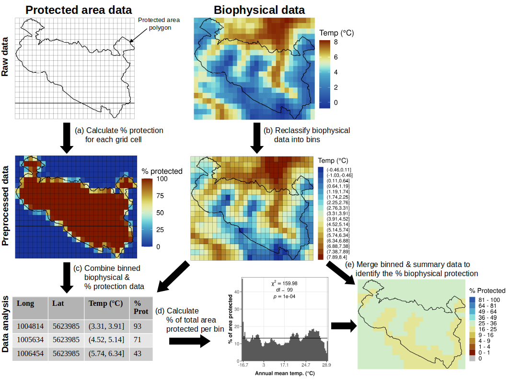
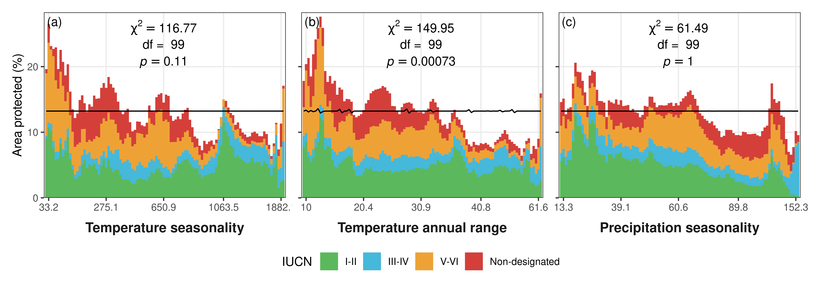
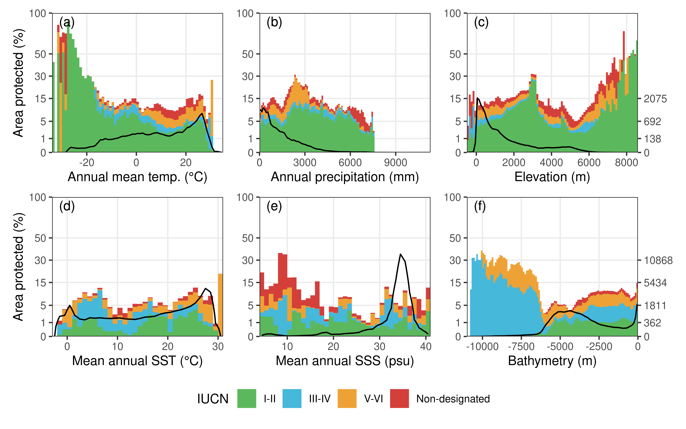

Representation of the world’s biophysical conditions by the global
protected area network
================

**How to cite this article:** Biber, M. F., Voskamp, A., & Hof, C.
(2021). Representation of the world’s biophysical conditions by the
global protected area network. Conservation Biology. 202100;1-12.
<https://doi.org/10.1111/cobi.13822>

**Running head:** Global protection of abiotic conditions

## Abstract

Protected areas (PAs) are often implemented without consideration of
already existing PAs, which is likely to cause an overrepresentation of
certain biophysical conditions. We assessed the representativeness of
the current PA network with regard to the world’s biophysical conditions
to highlight which conditions are underprotected and where these are
located. We overlaid terrestrial and marine PAs with information on
biophysical conditions (e.g., temperature, precipitation, and elevation)
and then quantified the percentage of area covered by the PA network.
For one variable at a time in the terrestrial realm, high temperature,
low precipitation, and medium and very high elevation were
underrepresented. For the marine realm, low and medium sea surface
temperature (SST), medium and high sea surface salinity (SSS), and the
deep sea were underrepresented. Overall, protection was evenly
distributed for elevation across the terrestrial realm and SST across
the marine realm. For two variables at a time, cold and very dry
terrestrial environments had mostly low protection, which was also the
case for low SST and low and medium SSS across most depths for marine
environments. Low protection occurred mostly in the Sahara and the
Arabian Peninsula for the terrestrial realm and along the Tropic of
Capricorn and toward the poles for the marine realm. Although
biodiversity measures are of prime importance for the design of PA
networks, highlighting biophysical gaps in current PAs adds a frequently
overlooked perspective. These gaps may weaken the potential of PAs to
conserve biodiversity. Thus, our results may provide useful insights for
researchers, practitioners, and policy makers to establish a more
comprehensive global PA network.

**Keywords:** temperature, precipitation, salinity, elevation,
bathymetry, marine, terrestrial, abiotic conditions

Representación de las Condiciones Biofísicas del Mundo por medio de la
Red Mundial de Áreas Protegidas

**Resumen:** Las áreas protegidas (AP) son frecuentemente implementadas
sin considerar las ya existentes, lo que probablemente ocasiona una
sobrerrepresentación de ciertas condiciones biofísicas. Analizamos la
representatividad de la red actual de AP con respecto a las condiciones
biofísicas del mundo para resaltar que condiciones están subprotegidas y
en dónde se encuentran localizadas. Superpusimos las AP terrestres y
marinas con la información sobre las condiciones biofísicas (p. ej.:
temperatura, precipitación y elevación) y luego cuantificamos el
porcentaje de área cubierta por la red de AP. Para el análisis de una
variable a la vez, en el ambito terrestre la alta temperatura, baja
precipitación y las elevaciones media y muy alta estuvieron
subrepresentadas. Para el ambito marino, la baja y media temperatura de
la superficie marina (TSM), la media y alta salinidad de la superficie
marina (SSM) y el mar profundo estuvieron subrepresentados. En general,
la protección para la elevación en el ambito terrestre y para la TSM en
el ambito marino se distribuyó uniformemente. Para el análisis de dos
variables a la vez, los ambientes terrestres fríos y muy secos tuvieron
en su mayoría una baja protección, lo que también ocurrió para la baia
TSM y la baja y media SSM en casi todas las profundidades de los
entornos marinos. La baja protección  para el ambito terrestre estuvo
presente en su mayoría en el Sahara y en la Península Arábiga, y en el
ambito marino, a lo largo del Trópico de Cáncer y hacia los polos.
Aunque las medidas de biodiversidad son de suma importancia para el
diseño de las redes de AP, resaltar los vacíos de información biofísica
en las actuales AP añade una perspectiva que con frecuencia se ignora.
Estos vacíos pueden debilitar el potencial que tienen las AP para
conservar la biodiversidad. Por lo tanto, nuestros resultados pueden
proporcionar información útil para que investigadores, profesionales y
tomadores de decisiones establezcan una red mundial de AP más completa.

**Palabras clave:** batimetría, condiciones abióticas, elevación,
marino, precipitación, salinidad, temperatura, terrestre

## INTRODUCTION

Anthropogenic impacts on biodiversity often vary between land and ocean
as well as geographically, thus requiring different conservation
priorities for mitigation (Bowler et al. 2020). Protected areas (PAs)
are the most effective tool for in situ conservation (Chape et al. 2005)
and are crucial for reducing habitat loss (Geldmann et al. 2013),
protecting endangered species (Pacifici et al. 2020), safeguarding
biodiversity, and conserving ecosystem services (Stolton & Dudley 2010).

The global PA network has been growing steadily in number and extent,
which confirms government commitments to conservation of natural
ecosystems. To improve the status of biodiversity, the Aichi
Biodiversity Target 11 was set to protect at least 17% of terrestrial
and inland water and 10% of coastal and marine areas by 2020 (CBD 2011).
As of February 2021, around 15.4% of terrestrial areas and inland
waters, 17.8% of coastal and marine areas within national jurisdiction
and 1.2% of the global ocean (areas beyond national jurisdiction) were
covered by PAs (UNEP-WCMC et al. 2021). The target calls for the PA
network to be ecologically representative (CBD 2011), and a focus on
representativeness of ecoregions is recommended. Whilst this will likely
enhance coverage of geographically distinct species assemblages, it is
not necessarily equal to the representativeness of species or other
biological properties (Visconti et al. 2019). Various strategies, aiming
to enhance the ecological representativeness of PAs, have been
developed, ranging from coverage of genetic traits (Pollock et
al. 2017), groups of individual species (i.e. species of conservation
concern; Venter et al. 2018) or mountain biodiversity
(Rodriguez-Rodriguez et al. 2011) to wider aspects, including the
maintenance of phylogenetic (Rosauer et al. 2017), functional
(Guilhaumon et al. 2014), and geodiversity (Tukiainen et al. 2017) as
well as ecosystem functions (Harvey et al. 2017) and services (Eastwood
et al. 2016).

Accounting for future direct and indirect impacts of climate change is
also becoming increasingly important in conservation planning, and
various spatial prioritization approaches incorporating potential
impacts have been developed (Jones et al. 2016; Maxwell et al. 2020).
With regard to climate change, establishing a PA network that will be
ecologically representative in the future is difficult, whereas
protecting a representative set of current abiotic conditions is likely
to provide the required diversity of environments to support the
maintenance and establishment of biodiversity under future climatic
conditions (Ackerly et al. 2010; Anderson & Ferree 2010; Lawler et
al. 2015). It further allows forecasting of representativeness in the
face of future climate change (Elsen et al. 2020).

Given that nature is often considered as a continuous gradient of
biophysical conditions, rather than a set of discrete units (from
vegetation types to realms), evaluating the representativeness of nature
in PA networks based on biophysical gradients may be a promising
approach. The representation of climatic and topographic conditions
across terrestrial protected areas (TPAs) has been assessed at various
spatial scales, from local to global (e.g., Rouget et al. 2003; Batllori
et al. 2014; Elsen et al. 2018). Baldi et al. (2017, 2019) included the
representation of human and biological factors, while Sayre et
al. (2020) assessed the representation of terrestrial ecosystems. The
representation of biophysical conditions across marine protected areas
(MPAs) has been less studied (but see Devillers et al. \[2015\] and
Roberts et al. \[2019\]). To our knowledge no one has examined the
biophysical representativeness of MPAs at a global level.

We aimed to assess the protection coverage of the different biophysical
conditions globally and compare the current level of protection between
the marine and terrestrial realm. Thus, we assessed the global
protection of terrestrial and marine areas with respect to biophysical
factors: temperature, precipitation, topography, sea surface temperature
(SST), sea surface salinity (SSS), and bathymetry. We analyzed the
protection coverage of each individual biophysical factor across their
respective conditions and compared how the coverage of biophysical
conditions differed among protection categories because PAs with a low
protection (e.g., IUCN categories IV to VI) have only limited
restrictions on resource exploitation (Shafer, 2015). We specifically
tested how evenly the biophysical factors were covered by PAs and
highlighted under which conditions protection coverage was lower or
higher than expected. Given that biophysical variables often interact
strongly, we also analyzed the protection coverage of the pairwise
interaction of biophysical conditions and, to provide recommendations
for the establishment of future PAs, considered how protection coverage
of individual biophysical factors and their pairwise combinations were
distributed geographically.

## Methods

To evaluate the global protection coverage of biophysical conditions
among the terrestrial and marine realm, we combined the global protected
area and the biophysical data in a common grid which we used to perform
our analysis.

### Protected areas

Global PA data were derived from the World Database on Protected Areas
(UNEP-WCMC & IUCN, 2020) and contained polygon data for 225,098 PAs
(208,796 terrestrial, 10,724 coastal, 5,578 marine). We excluded PAs for
which only point information was available (21,250 PAs) because these
only provide information on their overall spatial position and areal
coverage, not on their exact spatial extent. The PA data were split into
marine (coastal and marine) and terrestrial (coastal and terrestrial)
PAs and then further divided into four IUCN protection categories: Ia,
Ib, and II (I-II); III and IV (III-IV); V and VI (V-VI); and not
reported, not applicable and not assigned (Non-designated).

The categories group PAs according to their management objectives.
Categories Ia, Ib, and II include strict nature reserves, wilderness
areas, and national parks and focus on the protection of intact
ecosystems (Dudley 2008). Categories III and IV include natural
monuments or features and habitat or species management areas, and
categories V-VI include protected land- and seascapes and protected
areas with sustainable use of natural resources.

For each protection category, we calculated the percentage of protection
cover for each grid cell of a raster with 30 arc-seconds resolution and
a spatial extent corresponding to the extent of the respective
biophysical data (Fig. 1 a). This resulted in a gridded layer of
percentage protection cover for each protection category for marine and
terrestrial areas. These layers were transformed into Mollweide
equal-area projection (ESRI:54009) and covered 162,067,794 and
421,197,812 cells for terrestrial and marine areas, respectively
(Appendix S1).

**Figure 1.** Methodological approach used to identify the protection
coverage of the different conditions for each biophysical variable: (a)
calculation of percentage of protection for each grid cell; (b)
reclassification of data for each biophysical variable into bins
observed with equal frequency; (c) merging of binned environmental and
gridded percentage of protection data; (d) summarization of merged data
by calculating percentage of total area protected per bin; (e) merging
of summary data with the geographic locations of each bin to identify
the protection coverage of each grid cell for a particular biophysical
variable.

We also calculated the percentage of protection cover for all categories
combined (total percentage protection) to determine where PAs of
different designation types overlapped (Deguignet et al. 2017). Total
percentage protection was then used to adjust cells of overlapping
extents (cells where the sum of the area protected of the individual
protection category layers was larger than the total area protected): we
added the area protected by each protection category, starting with the
strictest protection category, until the sum of the individual areas
reached the total area protected. This resulted in a non-overlapping
data set, always keeping the strictest protection category in areas with
overlapping polygons. This was necessary because if overlapping PAs were
not resolved, the underlying biophysical space would be counted multiple
times when calculating the total percentage cover.

### Terrestrial data

Annual mean temperature and annual precipitation were obtained from
Worldclim 2 (Fick & Hijmans 2017), which compiles climatic information
from 1970 to 2000 at a resolution of 30 arc seconds. We chose these two
variables because they are the main determinants of the world’s
terrestrial biomes (Holdridge 1947; Whittaker 1975). We also examined
temperature and precipitation seasonality and temperature annual range,
which we also obtained from Worldclim 2 (Appendix S3). Worldclim 2
interpolates observations from weather stations based on elevation and
distance to coast and maximum and minimum land surface temperature and
cloud cover derived from MODIS satellite data (Fick & Hijmans 2017).

Elevation data were obtained from EarthEnv (Amatulli et al. 2018). These
data are based on the global 250-m GMTED2010 digitial elevation model
output and averaged into a 30 arc-seconds grid (Amatulli et al. 2018).
We used elevation because it is a strong explanatory variable for
species richness (Kaufman & Willig 1998). The EarthEnv data set does not
include latitudes above 84°N and below -56°S, so we excluded these areas
from terrestrial analyses. Worldclim and EarthEnv layers were
transformed into Mollweide equal area projection (ESRI:54009; Appendix
S2).

### Marine data

Mean annual SST, mean annual SSS, and bathymetry were obtained from
MARSPEC (Sbrocco & Barber 2013). This high-resolution global marine data
set is a 10-fold improvement in spatial resolution over Bio-ORACLE)
(Tyberghein et al. 2012). It combines different satellite and in situ
observations of SST, SSS, and bathymetry of the global ocean into a
harmonized data set at a spatial resolution of 30 arc seconds.
Bathymetry data were derived from SRTM30\_PLUS 6.0, and the climatic
layers were derived from the World Ocean Atlas (SSS) and Ocean Color Web
(SST). The climatic variables rangeover varyingtime periods (SSS = 1955
– 2006, SST = 2002 – 2010), but information about interannual means and
their variance is provided (Sbrocco & Barber 2013). We also analyzed
annual range and annual variance in SSS and SST , which were also
obtained from MARSPEC (Appendix S3). All marine layers were transformed
into Mollweide equal area projection (ESRI:54009; Appendix S2).

### Protection coverage

We divided the amplitude of each biophysical variable into bins observed
with equal frequency. The respective optimal number of bins (n≤100) was
identified using the bins function of the binr package (Izrailev 2015)
in R (R Core Team, 2020). For most variables, the maximum number of bins
(n=100) was reached. Some strongly skewed variables resulted in a much
smaller number of bins. For each variable, we combined the binned
biophysical layer with the different percentage of-protection layers and
summarized them into the overall percentage of each bin protected
(hereafter protection coverage) (Fig. 1 c,d).

An expected value of protection for each bin was calculated by dividing
the total global terrestrial and marine area protected equally among the
area covered by each bin. This represents a world where all conditions
of a biophysical variable were evenly protected. For each individual
variable, we compared the protection coverage with the expected value of
protection for each bin and assessed the evenness in the distribution
(by comparing it with the expected value) using a chi-square
goodness-of-fit test. The chi-square value denoted the sum of error
values. A high value indicated a large deviance between observed and
expected values and thus implied a low evenness in distribution.

Given that using bins observed with equal frequency puts a stronger
emphasis on a small range of conditions (i.e., SSS 34-35.4 PSU), we also
assessed the protection coverage across each variable with equally
spaced bins (1°, 100 mm, 100 m, and 1 PSU for temperature and SST,
precipitation, elevation and bathymetry, and SSS, respectively
\[Appendix S4\]). While this puts the focus on discrete biophysical
conditions, it specifically highlights conditions that might be rare on
a global level; thus it is not meaningful for assessing the biophysical
representativeness of the global PA network.

To examine the protection interaction across multiple variables, we used
the same procedure for each pairwise combination of all terrestrial and
all marine variables separately.

To derive a map of protection coverage for each variable and their
respective pairwise combinations, which indicates how well the
underlying environmental condition of a given location is protected
globally, we combined the binned data with the protection coverage of
each individual bin and each pairwise combination (Fig. 1e). We
summarized the derived maps into the area covered by each zoogeographic
and marine realm (Appendix S3).

All analyses were performed in R 4.0 (R Core Team, 2020). Among others
we used R packages specifically designed for handling large spatial
data: sf (Pebesma, 2018), fasterize (Ross, 2020), exactextractr (Baston,
2020), and terra (Hijmans, 2020) and high-performance computers. The
full code is publicly available from
<https://github.com/RS-eco/globePA/>.

## Results

### Overall coverage

For the terrestrial realm, mostly very high (≥27° C) and low to
intermediate (0.6 – 20° C) temperature conditions were underprotected
(Fig. 2a). Low (≤151 mm), intermediate (270 - 571 mm), and some high
(1074 – 1610 mm) annual precipitation conditions were under-protected
(Fig. 2b), as were elevational conditions from 92 to 407 m, 452 to 729
m, and above 3944 m (Fig. 2c). The observed distribution of temperature
and precipitation significantly differed from the expected distribution
(p ≤ 0.05) (Fig. 2 a-c). Toward their upper range, all additional
terrestrial variables were underrepresented. Only temperature annual
range differed significantly from the expected distribution (p ≤ 0.05)
(Appendix S3). When we considered only PAs with category I-II (strict
protection), only annual mean temperature and precipitation differed
significantly from the expected distribution (p ≤ 0.05). For category
III-IV, all variables were evenly distributed (Appendix S3). Considering
the protection coverage across equally spaced bins, rare conditions, in
particular low temperature and high elevation, usually had a higher
protection coverage than common ones (Appendix S4).

**Figure 2.** Percentage area protected (Fig. 1d) divided by the
different International Union for Conservation of Nature categories
across biophysical conditions for different variables in the
terrestrial, (a) temperature, (b) precipitation, and (c) elevation), and
marine, (d) sea surface temperature (SST), (e) sea surface salinity
(SSS), and (f) bathymetry, realms. To calculate the percentage area
protected, the different biophysical conditions were divided into bins
observed with equal frequency. The optimal number of bins (n≤100) was
derived iteratively for each variable: (a) n= 100, (b) n= 100, (c) n=
100, (d) n= 96, (e) n= 84, and (f) n= 100). Black lines indicate the
expected percentage area protected given equal protection of all
conditions. For some variables this line is not flat because the
underlying data are strongly skewed, so no bins observed with absolute
equal frequency could be calculated. Individual bins of each variable
represent percentile ranges and so cover a different extent, which is
also reflected in the irregular intervals of the x-axis. See Appendix S4
for a similar figure based on equally spaced bins.

For the marine realm, particularly low and medium SST were
under-protected (Fig. 2d). Intermediate (32.7 – 34.9 psu) and high (≥ 36
psu) SSS conditions were under-protected (Fig. 2 e), as was most of the
deep sea (-3634 - - 5999 m), in stark contrast to intermediate and very
shallow depths and depths below 6000 m (Fig. 2f). For the marine realm,
SSS and bathymetry showed a significant difference (p ≤ 0.05) in
goodness of fit between the expected and observed distribution, but the
contribution of the protection category varied strongly across
conditions, at least for SST and SSS (Fig. 2 d-f). Variance and annual
range in SST were under-protected for distinct lower and upper
conditions, whereas almost all conditions in annual range and annual
variance in SSS were under-protected. Only annual variance in SST
differed significantly from the expected distribution (p ≤ 0.05,
Appendix S3). For bathymetry, annual range in SST, and all SSS
variables, the protection coverage was evenly distributed across all
protection categories, whereas mean annual and annual variance in SST
differed significantly from the expected distribution (p ≤ 0.05) for
categories III-IV and Non-designated (Appendix S3). For equally spaced
bins, rare conditions, specifically low SSS and very deep conditions,
usually had a higher protection coverage than more common ones (Appendix
S4).

### Interaction coverage

For temperature and precipitation pairwise interactions, primarily
conditions at the lower temperature and upper precipitation limit had a
high protection coverage, whereas conditions that were either at the
upper temperature limit or at the lower precipitation limit tended to be
only marginally protected. There were discrete conditions with very low
temperatures and low and high precipitation that were completely
unprotected (Fig. 3a). For the temperature and elevation interaction,
areas with low temperature and low elevation were very strongly
protected, whereas mostly very high temperature and high elevation
conditions were only marginally protected (Fig. 3b). For precipitation
and elevation the majority of the upper precipitation limits had a high
protection coverage across all elevational bands, whereas conditions
with low precipitation and very high elevation were either marginally
protected or completely unprotected (Fig. 3c). Overall, the combination
of temperature and elevation was best protected (largest area with high
protection), whereas the combination of temperature and precipitation
had the largest area with low protection (Fig 3d).

**Figure 3.** Percentage of land area (a, b, c) and marine area (d, e,
f) protected by each pairwise combination of the biophysical variables
considered (temperature vs. precipitation, temperature vs. elevation and
precipitation vs. elevation, sea surface temperature \[SST\] vs. sea
surface salinity \[SSS\], SST vs. bathymetry, SSS vs. bathymetry).
Pixels are based on the bins observed with equal frequency shown in Fig.
2 (see Appendix S4 for a similar figure based on equally spaced bins).
Total area covered by certain levels of protection (d, h). The percent
area protected was calculated considering all International Union for
Conservation of Nature protection categories (I-II, III-IV, V-VI, and
Non-designated) together. Because percentage of area protected is not
normally distributed, the color key is divided into 10 intervals
reflecting a log10-transformed continuous scale.

For the marine realm, patterns were less clear. Most SSS and SST
conditions were only marginally or completely unprotected. A few
well-protected conditions occurred most frequently at high SSS across
various SST conditions (Fig. 3e). For bathymetry and SST (Fig. 3f) and
bathymetry and SSS (Fig. 3g), very well-protected conditions occurred
mostly at very shallow depths (0 – 46 m) across all SSS and SST
conditions (Fig. 3f, g), in depths deeper than 5755 m with very low
(around 0° C) SST (Fig. 3f) and at SSS conditions of 32 – 32.5 and 35.4
– 35.7 PSU across most depths (Fig. 3g). Low and no protection occurred
mostly with low SST (around 10° C) across various depths (Fig. 3f) and
very low (around 20 PSU) and medium (around 34.5 PSU) SSS across various
depths (Fig. 3g). For the marine realm, the combination of SST and SSS
showed the largest area with low protection, and all pairwise
combinations had a considerable area with unprotected conditions (Fig.
3h).

### Spatial patterns

Sixty-eight percent of the terrestrial realm had temperature conditions
that were protected by 10 - 16%. Greenland exhibited unique temperature
conditions that had high protection, whereas large parts of the Sahara
and the Arabian Peninsula exhibited temperatures that were only
marginally protected (Fig. 4a). Around 77% of the terrestrial realm had
precipitation levels that were protected by 10 – 16 %and 9% that were
protected by 16 – 25 %. The northern part of South America (mostly
Colombia, Peru, Bolivia, and Brazil), some tropical regions in West
Africa and parts of Indonesia and China (mostly Himalayans) had
precipitation levels with a high protection (Fig. 4b). Eighty-nine
percent of the terrestrial realm had elevational bands that were
protected by 10 – 16% and 9.9% that were protected by 16 – 25%.
Elevational conditions with high protection were located mostly in
Greenland and China (Fig. 4c). For the spatial overlap of different
terrestrial variables, we found that unique combinations of temperature
and precipitation that were protected by ≤16 % occurred all over the
world, covering about 71 % of the terrestrial realm (Fig. 3d). Areas
with low protection were mostly located in the western United States,
large parts of the Sahara, the Arabian Peninsula, and parts of Central
Asia (Fig. 4d). Unique combinations of temperature and elevation that
were protected by ≤16 % covered around 73% of the terrestrial realm
(Fig. 3d). Areas where the combination of temperature and elevation
conditions were highly protected occurred mostly in Greenland and parts
of South America and Russia and China, whereas areas that were little
protected occurred mostly in the western Sahara and the Arabian
Peninsula, but also across Argentina, Australia, Russia, and the United
States (Fig. 4e). Areas that were protected by ≤16 % of unique
combinations of precipitation and elevation conditions covered 75% of
the terrestrial realm (Fig. 3d). Locations with low protection of this
combination were in Chile, parts of the Sahara, the Arabian Peninsula,
and China, whereas locations with highly protected conditions covered
large parts of northern South America, eastern Africa, Indonesia, New
Guinea, the Himalayan Mountains, and Greenland (Fig. 4 f). Overall,
protection coverage strongly differed among zoogeographic realms and the
variable or variable combination considered (Appendix S3).

**Figure 4.** Percentage of the terrestrial realm protected by each
biophysical condition, (a) temperature (Temp), (b) precipitation (Prec)
and (c) elevation, and their pairwise combinations, (d) temperature and
precipitation, (e) temperature and elevation, and (f) precipitation and
elevation. The percent area protected is based on the bins observed with
equal frequency shown in Figs. 2 and 3 and was calculated considering
all International Union for Conservation of Nature protection categories
(I-II, III-IV, V-VI, and Non-designated) together. Because percent
protected is not normally distributed, the color key is divided into 10
intervals reflecting a log10-transformed continuous scale. See Appendix
S4 for maps based on equally spaced bins. Maps are in Mollweide
projection (ESRI:54009).

Forty-three percent of marine areas had SST conditions that were
protected by 1 - 6% and 57% that were protected by 6 – 16% (Fig. 5a).
Forty-six percent of marine areas had SSS conditions that were protected
by 1 - 6 %and 54% that were protected by 6 – 25% (Fig. 5 b). Fourty-nine
percent of marine areas had a depth level that was protected by 2 - 6%
and 33%that were protected by 6 – 10% (Fig. 5c). SST conditions had
relatively high levels of protection in the Tropic of Cancer, Tropic of
Capricorn, the Arctic, and Antarctic Circle (Fig. 5 a), whereas areas
with low protection were mostly at the poles and east of New Guinea. SSS
was well-protected along the west coast of the United States and Canada
and the east coast of Australia, whereas areas with low SSS protection
occurred mostly in the Atlantic, Indian and South Pacific Oceans , and
the Gulf of Oman, (Fig. 5b). Well-protected bathymetry conditions were
mostly located along the coasts and the ocean trenches, and very-well
protected bathymetry conditions occurred along the coast of Australia,
most of the South China Sea, and most of the Arctic Ocean.

**Figure 5.** Percentage of the marine realm protected by each
biophysical condition, (a) sea surface temperature (SST), (b) sea
surface salinity (SSS), and (c) bathymetry, and their pairwise
combinations, (d) SST and SSS, (e) SST and bathymetry, and (f) SSS and
bathymetry. The percent area protected is based on the bins observed
with equal frequency shown in Figs. 2 and 3 and was calculated
considering all International Union for Conservation of Nature
protection categories (I-II, III-IV, V-VI, and Non-designated) together.
Because percent protected is not normally distributed, the color key is
divided into 10 intervals reflecting a log10-transformed continuous
scale. See Appendix S4 for maps based on equally spaced bins. Maps are
in Mollweide projection (ESRI:54009).

Areas that exhibited conditions that were not well protected covered the
remaining marine realm and occurred in all major oceans (Fig. 5 c). All
three variables had only a marginal area (≤3.5 %) with protection
coverage ≥16 % (Fig. 5a-c). The spatial patterns of the pairwise
comparison of SST, SSS, and bathymetry, showed that mostly the South
Pacific Ocean exhibited unique conditions of pairwise combinations of
biophysical variables that were highly protected, whereas, particularly,
the Tropic of Capricorn and parts of the Atlantic and North Pacific
Oceans had conditions that were only marginally protected (Fig. 5d,e,f).
Overall, protection coverage differed among marine realms and each
variable and the pairwise combinations (Appendix S3).

## Discussion

### Overall coverage

The protected area network provided a wide coverage of current
biophysical conditions across the terrestrial realm. However, for the
terrestrial realm low to intermediate and very high temperature and low
and medium precipitation conditions lacked protection (Fig. 2 a, b).
These conditions represent the majority of temperate regions and thus
are quite common. Rare biophysical conditions were usually much better
protected (Appendix S4). This bias might reflect historical human
settlement preferences; terrestrial protected areas (TPAs) are typically
biased toward isolated locations with low population density and low
suitability for agriculture and are mostly driven by opportunistic
forces rather than preferential and representative motivations (Joppa &
Pfaff 2009; Baldi et al. 2017).

Low and very high elevational levels were less protected than expected,
although overall elevation was evenly represented by the TPA network
(Fig. 2c). This is consistent with results by Joppa and Pfaff (2009)
that in the United States areas from 1000 to 4000 m elevation are
disproportionately protected. In contrast to Elsen et al. (2018), we did
not find a bias in TPAs toward high mountain systems . This is because
we considered elevational levels of equal frequency rather than discrete
levels (comparison in Appendix S4). While our approach (equal frequency
bins) led to a larger number of bins with low or medium elevations,
because these are more common, it may also be more meaningful when
assessing the representation of global biophysical conditions by PAs.
Another confounding factor, especially with regards to elevation (You et
al. 2018), is that some countries have stopped reporting their PAs to
UNEP-WCMC, so some PAs are not included in the World Database on
Protected Areas (Bingham et al. 2019).

The patterns across the marine realm were less clear, as low and medium
SST and medium and high SSS were underrepresented. For bathymetry, only
the deep sea was underrepresented (Fig. 2d–f). The lack of deep-sea
protection is cause for concern because the abyssal plain (2000 – 4000
m) is by surface area the largest habitat on Earth (Angel 1993) and its
biodiversity is largely unexplored (Webb et al. 2010). Even more
concerning, was the uneven distribution in SSS and bathymetry
protection. This could be because marine protected areas (MPAs) are
typically much larger in size, but fewer in number than TPAs, which
results in the protection of large areas with similar biophysical
conditions and thus an overrepresentation of these conditions on a
global level. This again highlights the importance to consider
biophysical conditions when designing and implementing new MPAs in order
to establish a representative global MPA network that helps safeguard
current and future biodiversity and ecosystem services. At the same
time, the establishment of new MPAs in places of low economic interest
without considering their value for conservation (Devillers et al. 2015)
needs to be avoided. Given that most marine areas are beyond national
jurisdiction, a globally coordinated establishment of representative
MPAs represents an enormous challenge, yet such an effort could
considerably help to protect biodiversity and simultaneously boost food
provisioning and carbon storage (Sala et al. 2021).

Protection categories in the terrestrial realm seemed to be evenly
represented, whereas for the marine realm certain SST, SSS, and
bathymetry conditions were mostly protected by category V-VI or
non-designated MPAs (Fig. 2). This is cause for concern given that PAs
in stricter protection categories are more likely to provide effective
conservation (Jones et al. 2018; Leberger et al. 2020) than PAs in low
protection categories (e.g., V-VI).

### Interaction coverage

In the terrestrial realm, the combination of low temperature and high
precipitation (Fig 3. a) had high protection coverage, as did the
combination of both low temperature and high precipitation with all
elevational levels (Fig. 3 b, c). Dry and hot as well as hot conditions
across all elevations had a low protection coverage (Fig. 3a-c). This is
consistent with Sayre et al.’s (2020) finding that cold and moist
ecosystems are well represented, whereas warm and dry environments are
not and also with Elsen et al.’s (2020) finding that there is a
protection bias toward rare portions of climate space, particularly cold
and wet environments (although they used equally spaced conditions;
comparison in Appendix S4).

For the marine realm, well-protected conditions were mostly present at
the upper limits of SSS across almost all SST conditions (Fig. 3e) and
at very shallow depths (0 – 46 m) across all SSS and SST conditions
(Fig. 3f, g), whereas very deep locations across various SST and low SSS
conditions across most depths were completely unprotected (Fig. 3f, g).
This again highlights a lack of protection in the marine realm. In order
to create a fully representative MPA network, these areas need to be
specifically targeted, irrespective of national jurisdictions (Liu et
al. 2020), when establishing new MPAs.

### Spatial patterns

Our assessment of how the representation of certain biophysical
conditions by the PA network is distributed across space at the global
level is important because, even though biophysical conditions are well
represented, these conditions might only occur in a single location
(e.g., mountain top) or be protected at a geographically distinct region
(e.g., Europe). This in turn may weaken the overall representativeness
of these biophysical conditions because the protected location or region
could be particularly vulnerable to anthropogenic impacts and climate
change, even if they are strictly protected.

Large parts of the terrestrial realm had temperature (68%),
precipitation (77%), and elevation (89%) conditions that were protected
by 10 – 16 % (Fig. 4a -c). Greenland, most of which is protected by a
single PA, the Northeast Greenland National Park, exhibited unique
temperatures that had high protection coverage. The northern part of
South America had a high protection coverage with regard to
precipitation conditions. However, this was mostly due to a large number
of PAs in low protection categories (V-VI) (Baldi et al. 2019). Low
protection in the terrestrial realm mostly occurred in parts of China
(Fig. 4 d), the Sahara, and the Arabian Peninsula (Fig. 4 d). Protection
of these regions is unlikely to conflict with human population pressure
or agricultural use (both should be relatively low), thus although
biodiversity is low in these areas, increasing the protection level may
contribute to conserve parts of the last areas on the planet that remain
largely uninfluenced by humans (Watson et al. 2018).

For the marine realm, 50% of SST, 46% of SSS, and 42% of bathymetry
conditions were protected between 7 – 16 % (Fig. 5 a – c).
Well-protected biophysical conditions occurred mostly along the coasts
and in the Tropics, whereas areas with low protection were mainly
located along the Cancer of Capricorn and toward the poles. But this is
counteracted by anthropogenic threats to marine ecosystems that
concentrate on continental shelves (Halpern et al. 2015) and so co-occur
with areas that exhibit well-protected conditions. Most marine areas had
a low protection of pairwise combinations of biophysical variables,
whereas a few areas, mostly east of Australia, had multiple variables
protected by ≥16 % (Fig. 5d, e, f). However, this result depended on the
overall spatial extent considered. For local representativeness of
Australian MPAs, Roberts et al. (2019) found that Australian MPAs
overrepresent warm, offshore waters and underrepresent temperate
environments.

### Challenges and potential caveats

While the variables considered are important in explaining the
distribution of biomes and species richness, they do not fully represent
the biophysical conditions of the world and there are other factors,
such as geology, soil, current velocity, and availability of resources,
that influence species distribution, composition, and diversity
(Anderson & Ferree 2010; Rees et al. 1999; Lawler et al. 2015). We did
not consider variability in climate or topography within a grid cell,
although microclimate and terrain ruggedness are also important
surrogates for biodiversity and potentially also ecosystem services
(Bramer et al. 2018, Amatulli et al. 2018).

Even if the current global PA network fully represented the diversity of
current biophysical conditions, which would likely favor the maintenance
and establishment of biodiversity under climate change (Ackerly et
al. 2010; Lawler et al. 2015), the representativeness of nature exceeds
biophysical conditions and there are many other factors that affect
conservation effectiveness (Watson et al. 2014). Given that the Aichi
Biodiversity Target 11 calls for “ecologically representative PAs of
particular importance for biodiversity and ecosystem services,” biotic
measures (e.g., number of threatened species \[Venter et al. 2018\];
biotic interactions \[Lawler et al. 2015\]; phylogenetic \[Rosauer et
al. 2017\], functional \[Guilhaumon et al. 2014\], and geodiversity
\[Tukiainen et al. 2017\]; the coverage of climatic niches \[Hanson et
al. 2020\]; and ecosystem functions \[Harvey et al. 2017\] and services
\[Eastwood et al. 2016\]) are additional factors to be considered.
Nevertheless, currently neither the world’s most diverse nor the most
productive ecosystems are the most protected (Lindegren et al. 2018;
Maxwell et al. 2020), although on the level of ecoregions the global PA
network is strongly related to biodiversity measures (Loucks et
al. 2008).

While topographic conditions (elevation, bathymetry) remain relatively
constant through time, climatic conditions are subject to drastic change
in the near and far future (IPCC 2013). This will have strong effects on
the PA network because some of the protected abiotic conditions will
disappear and new nonanalog climates may appear (Elsen et al. 2020).

We did not consider whether cells that covered a biophysical condition
were protected by one large or multiple small PAs or assess the extent
of the cells covered or their connectivity. Given that connectivity
among PAs will become even more important when species that are
currently under protection shift their ranges to track changing climatic
conditions (Littlefield et al. 2017), one also needs to consider the
size and connectivity of PAs and the protection retention of future
climatic conditions (Elsen et al. 2020) when assessing the
representativeness of the global PA network.

### Concluding remarks

Our results highlight potential gaps in the global coverage of
biophysical conditions by the current PA network. To conserve global
biodiversity and ecosystem services, PAs need to represent all of the
world’s ecosystems and the areas that contain exceptional or endemic
species and habitats (Olson & Dinerstein 2002; Davidson & Dulvey 2017).
Thus, future conservation actions need to be driven by preferential and
representative motivations rather than opportunistic forces (Baldi et
al. 2017).

Given the rising challenges of climate change, a conservation planning
approach that increases the coverage of species, ecosystems, and
ecological processes is crucial because climate change may lead to new
species communities and even new ecosystem types (Mawdsley et al. 2009).
While biodiversity measures are of prime importance for PA planning
strategies, precise knowledge of species distributions is still lacking
for many species, particularly noniconic ones. Our assessment of the
representativeness of biophysical conditions thus adds a frequently
overlooked perspective. We believe our results provide useful insights
for researchers, conservation practitioners, and policy makers to
improve prioritization efforts for a more comprehensive future global PA
network.

## Literature Cited

Ackerly DD, Loarie SR, Cornwell WK, Weiss SB, Hamilton H, Branciforte R,
& Kraft NJB. 2010. The geography of climate change: implications for
conservation biogeography. Diversity and Distributions, 16:3, 476-487.

Anderson MG, Ferree CE. 2010. Conserving the Stage: Climate Change and
the Geophysical Underpinnings of Species Diversity. PLoS ON, 5:7.

Amatulli G, Domisch S, Tuanmu MN, Parmentier B, Ranipeta A, Malczyk J, &
Jetz W. 2018. A suite of global, cross-scale topographic variables for
environmental and biodiversity modeling. Scientific Data 5:180040.

Angel MV. 1993. Biodiversity of the pelagic ocean. Conservation Biology,
7:4, 760-772.

Baldi G, Texeira M, Martin OA, Grau HR, & Jobbágy EG. 2017.
Opportunities drive the global distribution of protected areas. PeerJ,
5:e2989.

Baldi G, Schauman S, Texeira M, Marinaro S, Martin OA, Gandini P, &
Jobbágy EG. 2019. Nature representation in South American protected
areas: country contrasts and conservation priorities. PeerJ, 7:e7155.

Baston D. 2020. exactextractr: Fast Extraction from Raster Datasets
using Polygons. R package version 0.4.0.
<https://CRAN.R-project.org/package=exactextractr>.

Batllori E, Miller C, Parisien MA, Parks SA, & Moritz MA. 2014. Is US
climatic diversity well represented within the existing federal
protection network? Ecological Applications, 24(8), 1898-1907.

Bingham HC, Bignoli DJ, Lewis E, MacSharry B, Burgess ND, Visconti P, …
& Kingston N. 2019. Sixty years of tracking conservation progress using
the World Database on Protected Areas. Nature ecology & evolution, 3(5),
737-743.

Bowler DE, et al. 2020. Mapping human pressures on biodiversity across
the planet uncovers anthropogenic threat complexes. People and NatureI,
2:2, 380-394.

Bramer I, et al. 2018. Advances in monitoring and modelling climate at
ecologically relevant scales. Advances in Ecological Research,
58:101-161.

Convention on Biological Diversity (CBD). 2011. Aichi Target 11.
Decision X/2. Convention on Biological Diversity.

Chape S, Harrison J, Spalding M, & Lysenko I. 2005. Measuring the extent
and effectiveness of protected areas as an indicator for meeting global
biodiversity targets. Philosophical Transactions of the Royal Society B:
Biological Sciences, 360:1454, 443-455.

Davidson LN, & Dulvy NK. 2017. Global marine protected areas to prevent
extinctions. Nature Ecology & Evolution, 1:2, 1-6.

Deguignet M, Arnell A, Juffe-Bignoli D, Shi Y, Bingham H, MacSharry B, &
Kingston N. 2017. Measuring the extent of overlaps in protected area
designations. PLoS ONE, 12:e0188681.

Devillers R, Pressey RL, Grech A, Kittinger JN, Edgar GJ, Ward T, &
Watson R. 2015. Reinventing residual reserves in the sea: are we
favouring ease of establishment over need for protection?. Aquatic
Conservation: Marine and Freshwater Ecosystems, 25:4, 480-504.

Dudley N. 2008. Guidelines for Applying Protected Area Management
Categories. Gland, Switzerland: IUCN.

Eastwood A, et al. 2016. Does nature conservation enhance ecosystem
services delivery? Ecosystem Services, 17:152-162.

Elsen PR, Monahan WB, & Merenlender AM. 2018. Global patterns of
protection of elevational gradients in mountain ranges. Proceedings of
the National Academy of Sciences, 115:23, 6004-6009.

Elsen PR, Monahan WB, Dougherty ER, & Merenlender AM. 2020. Keeping pace
with climate change in global terrestrial protected areas. Science
Advances, 6:25, eaay0814.

Fick SE, & Hijmans RJ. 2017. WorldClim 2: new 1‐km spatial resolution
climate surfaces for global land areas. International Journal of
Climatology, 37:12, 4302-4315.

Geldmann J, Barnes M, Coad L, Craigie ID, Hockings M, & Burgess ND.
2013. Effectiveness of terrestrial protected areas in reducing habitat
loss and population declines. Biological Conservation, 161:230-238.

Guilhaumon F, et al. 2015. Representing taxonomic, phylogenetic and
functional diversity: new challenges for Mediterranean marine‐protected
areas. Diversity and Distributions, 21:2, 175-187.

Halpern BS, et al. 2015. Spatial and temporal changes in cumulative
human impacts on the world’s ocean. Nature Communications, 6:1, 1-7.

Hanson JO, Rhodes JR, Butchart SH, Buchanan GM, Rondinini C, Ficetola
GF, & Fuller RA. 2020. Global conservation of species’ niches. Nature,
580:7802, 232-234.

Harvey E, Gounand I, Ward CL, & Altermatt F. 2017. Bridging ecology and
conservation: from ecological networks to ecosystem function. Journal of
Applied Ecology, 54:2, 371-379.

Hijmans RJ. 2020. terra: Spatial Data Analysis. R package version 0.8-6.
<https://CRAN.R-project.org/package=terra>.

Holdridge LR. 1947. Determination of world plant formations from simple
climatic data. Science, 105:2727, 367-368.

IPCC. 2013. Climate Change 2013: The Physical Science Basis.
Contribution of Working Group I to the Fifth Assessment Report of the
Intergovernmental Panel on Climate Change \[Stocker TF, et al. (eds.)\].
Cambridge University Press, Cambridge, United Kingdom.

Izrailev S. 2015. binr: Cut Numeric Values into Evenly Distributed
Groups. R package version 1.1.
<https://CRAN.R-project.org/package=binr>.

Jones KR, Watson JE, Possingham HP, & Klein CJ. 2016. Incorporating
climate change into spatial conservation prioritisation: A review.
Biological Conservation, 194, 121-130.

Jones KR, Venter O, Fuller RA, Allan JR, Maxwell SL, Negret PJ, & Watson
JE. 2018. One-third of global protected land is under intense human
pressure. Science, 360:6390, 788-791.

Joppa LN, & Pfaff A. 2009. High and far: biases in the location of
protected areas. PloS One, 4:12.

Kaufman DM, & Willig MR. 1998. Latitudinal patterns of mammalian species
richness in the New World: the effects of sampling method and faunal
group. Journal of Biogeography, 25:4, 795-805.

Lawler JJ, et al. 2015. The theory behind, and the challenges of,
conserving nature’s stage in a time of rapid change. Conservation
Biology, 29:3, 618-629.

Leberger R, Rosa IM, Guerra, CA, Wolf F, & Pereira HM. 2020. Global
patterns of forest loss across IUCN categories of protected areas.
Biological Conservation, 241:108299.

Lindegren M, Holt BG, MacKenzie BR, & Rahbek C. 2018. A global mismatch
in the protection of multiple marine biodiversity components and
ecosystem services. Scientific Reports, 8:1, 1-8.

Littlefield CE, McRae BH, Michalak JL, Lawler JJ, & Carroll C. 2017.
Connecting today’s climates to future climate analogs to facilitate
movement of species under climate change. Conservation Biology, 31:6,
1397-1408.

Liu J, Yong DL, Choi CY, & Gibson L. 2020. Transboundary Frontiers: An
Emerging Priority for Biodiversity Conservation. Trends in Ecology &
Evolution, 35:8, 679-690.

Loucks C, Ricketts TH, Naidoo R, Lamoreux J, & Hoekstra J. 2008.
Explaining the global pattern of protected area coverage: relative
importance of vertebrate biodiversity, human activities and agricultural
suitability. Journal of Biogeography, 35:8, 1337-1348.

Maxwell SL, et al. 2020. Area-based conservation in the twenty-first
century. Nature, 586:7828, 217-227.

Mawdsley JR, O’Malley R, & Ojima DS. 2009. A review of climate‐change
adaptation strategies for wildlife management and biodiversity
conservation. Conservation Biology, 23(5), 1080-1089.

Olson DM, & Dinerstein E. 2002. The Global 200: Priority Ecoregions for
Global Conservation, Annals of the Missouri Botanical Garden,
8:92,199-224.

Pacifici M, Di Marco M, & Watson JEM. 2020. Protected areas are now the
last strongholds for many imperiled mammal species. Conservation
Letters, e12748.

Pebesma E. 2018. Simple Features for R: Standardized Support for Spatial
Vector Data. The R Journal, 10:1, 439-446.

Pollock L, Thuiller W, & Jetz W. 2017. Large conservation gains possible
for global biodiversity facets. Nature, 546, 141–144.

R Core Team. 2020. R: A language and environment for statistical
computing. R Foundation for Statistical Computing, Vienna, Austria.
<https://www.R-project.org/>.

Rees HL, Pendle MA, Waldock R, Limpenny DS, & Boyd SE. 1999. A
comparison of benthic biodiversity in the North Sea, English Channel,
and Celtic Seas. ICES Journal of Marine Science, 56:2, 228-246.

Roberts KE, Duffy GA, & Cook CN. 2019. Bio‐physical models of marine
environments reveal biases in the representation of protected areas.
Aquatic Conservation: Marine and Freshwater Ecosystems, 29:499-510.

Rodríguez-Rodríguez D, Bomhard B, Butchart SH, & Foster MN. 2011.
Progress towards international targets for protected area coverage in
mountains: a multi-scale assessment. Biological Conservation, 144:12,
2978-2983.

Rosauer DF, Pollock LJ, Linke S, & Jetz W. 2017. Phylogenetically
informed spatial planning is required to conserve the mammalian tree of
life. Proceedings of the Royal Society B: Biological Sciences, 284:1865,
20170627.

Ross N. 2020. fasterize: Fast Polygon to Raster Conversion. R package
version 1.0.3. <https://CRAN.R-project.org/package=fasterize>.

Rouget M, Richardson DM, & Cowling RM. 2003. The current configuration
of protected areas in the Cape Floristic Region, South
Africa—reservation bias and representation of biodiversity patterns and
processes. Biological Conservation, 112:1-2, 129-145.

Sala E, et al. 2021. Protecting the global ocean for biodiversity, food
and climate. Nature, 1-6.

Sayre R, et al. 2020. An assessment of the representation of ecosystems
in global protected areas using new maps of World Climate Regions and
World Ecosystems. Global Ecology and Conservation, 21:e00860.

Sbrocco EJ, & Barber PH. 2013. MARSPEC: ocean climate layers for marine
spatial ecology: Ecological Archives E094‐086. Ecology, 94:4, 979-979.

Shafer CL. 2015. Cautionary thoughts on IUCN protected area management
categories V–VI. Global Ecology and Conservation, 3, 331-348.

Stolton S, & Dudley N. 2010. Arguments for protected areas: Multiple
benefits for Conservation and Use, Earthscan (UK).

Tukiainen H, Bailey JJ, Field R, Kangas K, & Hjort J. 2017. Combining
geodiversity with climate and topography to account for threatened
species richness. Conservation Biology, 31:2, 364-375.

Tyberghein L, Verbruggen H, Pauly K, Troupin C, Mineur F, & De Clerck O.
2012. Bio‐ORACLE: a global environmental dataset for marine species
distribution modelling. Global Ecology and Biogeography, 21:2, 272-281.

UNEP‐WCMC, & IUCN. 2020. Protected Planet: The World Database on
Protected Areas (WDPA). www.protectedplanet.net.

UNEP-WCMC, IUCN, & NGS. 2021. Protected Planet Live Report 2021.
UNEP-WCMC, IUCN and NGS: Cambridge UK; Gland, Switzerland; and
Washington, D.C., USA. Available from
<https://livereport.protectedplanet.net/> (accessed March 2021).

Venter O, Magrach A, Outram N, Klein CJ, Possingham HP, Di Marco M, &
Watson JE. 2018. Bias in protected‐area location and its effects on
long‐term aspirations of biodiversity conventions. Conservation Biology,
32:1, 127-134.

Visconti P, Butchart SH, Brooks TM, Langhammer PF, Marnewick D, Vergara
S, Yanosky A, & Watson JE. 2019. Protected area targets post-2020.
Science, 364:6437, 239-241.

Watson JEM, Dudley N, Segan DB, & Hockings M. 2014. The performance and
potential of protected areas. Nature, 515:67-73.

Watson JEM, Venter O, Lee J, Jones KR, Robinson JG, Possingham HP, &
Allan JR. 2018. Protect the last of the wild. Nature, 536:27–30.

Webb TJ, Berghe EV, & O’Dor R. 2010. Biodiversity’s big wet secret: the
global distribution of marine biological records reveals chronic
under-exploration of the deep pelagic ocean. PloS One, 5:8.

Whittaker RH. 1975. Communities and ecosystems, 2nd ed. - Macmillan, New
York.

You Z, Hu J, Wei Q, Li C, Deng X, & Jiang Z. 2018. Pitfall of big
databases. Proceedings of the National Academy of Sciences, 115(39),
E9026-E9028.

## Supporting Information

### Appendix S1: Gridded protected area data

**Figure S1.** Maps of percentage protected per grid cell for each of
the four protection categories (I-II, III-IV, V-VI, Non-designated).
Maps are in Mollweide projection (ESRI:54009).

### Appendix S2: Environmental data

**Figure S2.** Maps of (a) mean annual temperature (Temp, °C), (b)
annual precipitation (Prec, mm), both derived from Worldclim v2 (Fick &
Hijmans 2017), and (c) elevation (m) obtained from EarthEnv (Amatulli et
al. 2018). Maps are in Mollweide projection (ESRI:54009).

**Figure S3.** Maps of (a) temperature seasonality, (b) temperature
annual range and (c) precipitation seasonality according to Worldclim v2
(Fick & Hijmans 2017). Maps are in Mollweide projection (ESRI:54009).

**Figure S4.** Maps of (a) mean annual sea surface temperature (SST,
°C), (b) mean annual sea surface salinity (SSS, psu) and (c) bathymetry
(Bathy, m) according to MARSPEC (Sbrocco & Barber 2013). Maps are in
Mollweide projection (ESRI:54009).

**Figure S5.** Maps of (a) annual range in sea surface temperature (SST,
°C), (b) annual variance in SST, (c) annual range in sea surface
salinity (SSS, psu) and (d) annual variance in SSS according to MARSPEC
(Sbrocco & Barber 2013). Maps are in Mollweide projection (ESRI:54009).

### Appendix S3: Additional and extended results

**Figure S6.** Percentage of area protected, separately for different
IUCN categories, for different additional climatic conditions for the
terrestrial realm, with (a) temperature seasonality, (b) temperature
annual range and (c) precipitation seasonality. In order to calculate
the percentage of area protected, the different biophysical conditions
were divided into bins observed with equal frequency. The optimal number
of bins (N &lt;= 100) was derived iteratively for each variable ((a),
(b), (c) N = 100). Black lines indicate the expected percentage of area
protected given that all conditions are evenly protected. For some
variables this line is not flat, as the underlying data is strongly
skewed and so no bins observed with absolute equal frequency could be
calculated. Note that the individual bins of each variable represent
percentile ranges and so cover a different extent, which is also
reflected in the irregular intervals of the x-axis.

**Figure S7.** Percentage of terrestrial area protected for each IUCN
category (I-II, III-IV, V-VI and Not-designated) and each biophysical
variable (Annual mean temperature (°C), temperature seasonality,
temperature annual range, annual precipitation (mm), precipitation
seasonality and elevation) separately. In order to calculate the
percentage of area protected, the different biophysical conditions were
divided into bins observed with equal frequency. The optimal number of
bins (N &lt;= 100) was derived iteratively for each variable. Black
lines indicate the expected percentage of area protected given that all
conditions are evenly protected across all IUCN categories. For some
variables this line is not flat, as the underlying data is strongly
skewed and so no bins observed with absolute equal frequency could be
calculated. Note that the individual bins of each variable represent
percentile ranges and so cover a different extent, which is also
reflected in the irregular intervals of the x-axis.

**Figure S8.** Percentage of area protected, separately for different
IUCN categories, for different additional climatic conditions for the
marine realm, with (a) annual range in SST, (b) annual variance in SST,
(c) annual range in SSS and (d) annual variance in SSS. In order to
calculate the percentage of area protected, the different biophysical
conditions were divided into bins observed with equal frequency. The
optimal number of bins (N &lt;= 100) was derived iteratively for each
variable ((a) N = 97, (b) N = 98, (c) N = 69, (d) N = 81). Black lines
indicate the expected percentage of area protected given that all
conditions are evenly protected. For some variables this line is not
flat, as the underlying data is strongly skewed and so no bins observed
with absolute equal frequency could be calculated. Note that the
individual bins of each variable represent percentile ranges and so
cover a different extent, which is also reflected in the irregular
intervals of the x-axis.

**Figure S9.** Percentage of marine area protected separately for each
IUCN category (I-II, III-IV, V-VI and Not-designated) and each
biophysical variable (Mean annual sea surface temperature (SST, °C),
annual range in SST, annual variance in SST, mean annual sea surface
salinity (SSS, psu), annual range in SSS and annual variance in SSS)
separately. In order to calculate the percentage of area protected, the
different biophysical conditions were divided into bins observed with
equal frequency. The optimal number of bins (N &lt;= 100) was derived
iteratively for each variable. Black lines indicate the expected
percentage of area protected given that all conditions are evenly
protected across all IUCN categories. For some variables this line is
not flat, as the underlying data is strongly skewed and so no bins
observed with absolute equal frequency could be calculated. Note that
the individual bins of each variable represent percentile ranges and so
cover a different extent, which is also reflected in the irregular
intervals of the x-axis.

**Figure S10.** Area of each zoogeographic realm and the percentage
protected by each biophysical condition ((a) temperature, (b)
precipitation and (c) elevation) and their pairwise combinations ((d)
temperature and precipitation, (e) temperature and elevation, (f)
precipitation and elevation). The percentage protected´ was calculated
considering all protection categories (I-II, III-IV, V-VI and
non-designated) together. Given that the percentage protected is
not-normally distributed, the color legend is divided into 12 intervals
reflecting a log10-transformed continuous scale.

**Figure S11.** Area of each marine realm and the percentage protected
by each each biophysical condition ((a) SST, (b) Salinity and (c)
Bathymetry) and their pairwise combinations ((d) SST and Salinity, (e)
SST and Bathymetry, (f) SSS and Bathymetry). The percentage protected
was calculated considering all protection categories (I-II, III-IV, V-VI
and non-designated) together. Given that the percentage protected is
not-normally distributed, the color legend is divided into 12 intervals
reflecting a log10-transformed continuous scale.

### Appendix S4: Results with equally-spaced bins

**Figure S12.** Percentage of area protected, separately for different
IUCN categories, for different biophysical conditions in the terrestrial
(a, b, c) and marine (d, e, f) realm. In order to calculate the
percentage of area protected, the different biophysical conditions were
divided into equally-spaced bins (1° for temperature and sea surface
temperature, 100 mm for precipitation, 1 psu for salinity and 100 m for
elevation and bathymetry). Black lines indicate the area that is covered
globally by each of the different bins (y-axis on the right-hand side).
Note that the scales of both y-axes are square-root transformed.

**Figure S13.** Percentage of land area (a, b, c) and marine area (d, e,
f) protected by each pairwise combination of biophysical variables
considered (temperature vs. precipitation, temperature vs. elevation and
precipitation vs. elevation, sea surface temperature vs. salinity, sea
surface temperature vs. bathymetry, salinity vs. bathymetry). Pixels are
based on the equally-spaced bins shown in Figure S12. Bar charts
indicate the total area that is covered by certain levels of protection.
The percentage area protected was calculated considering all protection
categories (I-II, III-IV, V-VI and non-designated) together. Given that
the percentage protected is not-normally distributed, the color legend
is divided into 12 intervals reflecting a log10-transformed continuous
scale.

**Figure S14.** Available land area (a, d, g), protected land area (b,
e, h) and the percentage area protected (c, f, h) of each pairwise
combination of the biophysical variables (temperature vs. precipitation,
temperature vs. elevation and precipitation vs. elevation) based on the
equally-spaced bins shown in Figure S12. The percentage area protected
was calculated considering all protection categories (I-II, III-IV, V-VI
and non-designated) together.

**Figure S15.** Available marine area (a, d, g), protected marine area
(b, e, h) and the percentage area protected (c, f, h) of each pairwise
combination of the biophysical variables (sea surface temperature
vs. salinity, sea surface temperature vs. bathymetry, salinity
vs. bathymetry) based on the equally-spaced bins shown in Figure S12.
The percentage area protected was calculated considering all protection
categories (I-II, III-IV, V-VI and non-designated) together.

**Figure S16.** Maps of the percentage of terrestrial realm protected by
each biophysical condition ((a) temperature, (b) precipitation and (c)
elevation) and their pairwise combinations ((d) temperature and
precipitation, (e) temperature and elevation, (f) precipitation and
elevation). The percentage area protected is based on the equally-spaced
bins (1°/100mm/100m) shown in Figure S12, S13 and was calculated
considering all protection categories (I-II, III-IV, V-VI and
non-designated) together. Given that the percentage area protected is
not-normally distributed, the color legend is divided into 12 intervals
reflecting a log10-transformed continuous scale. Maps are in Mollweide
projection (ESRI:54009).

**Figure S17.** Maps of the percentage of the marine realm protected by
each biophysical condition ((a) SST, (b) Salinity and (c) Bathymetry)
and their pairwise combinations ((d) SST and Salinity, (e) SST and
Bathymetry, (f) SSS and Bathymetry). The percentage area protected is
based on the equally-spaced bins (1°/1psu/100m) shown in Figure S12, S13
and was calculated considering all protection categories (I-II, III-IV,
V-VI and non-designated) together. Given that the percentage area
protected is not-normally distributed, the color legend is divided into
12 intervals reflecting a log10-transformed continuous scale. Maps are
in Mollweide projection (ESRI:54009).
